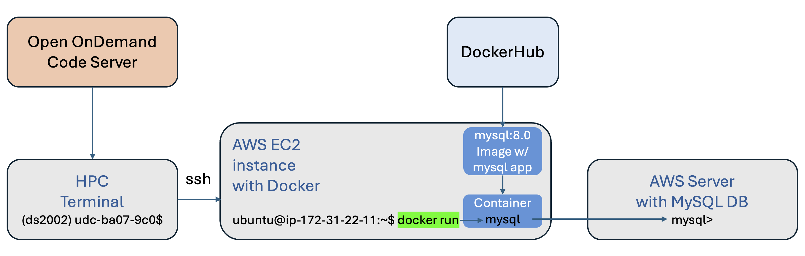

# Lab 10: Containers (Docker on EC2 & Apptainer on HPC)

## Case study

Your team already has a Linux server in the cloud from [Lab 09](../09-ec2/README.md). Now they want to **standardize on containers**: run tools without installing every package on the host, and reuse the same images in the cloud and on the university cluster. In this lab you install **Docker** on that EC2 instance, use the official **`mysql:8.0`** image as a disposable MySQL **client** to connect to the course **AWS RDS** database from Lab 05, apply an update script and a query, and copy evidence back to your fork. On **UVA HPC**, you pull a Docker image as an **Apptainer** `.sif` file, run it interactively, then drive it from a **Slurm job array** and collect outputs.

When you finish, you will have exercised the “install runtime → pull/run image → integrate with batch scheduler” path and will submit SQL artifacts, query output, and Slurm-related files.

## Learning goals

By completing this lab, you will be able to:

- Install Docker on Ubuntu EC2 and verify it with `hello-world`.
- Run the MySQL client inside `mysql:8.0` to connect to the course RDS instance (same pattern as [Lab 05, Option B (Docker → AWS RDS)](../05-sql/README.md#setup)).
- Apply a SQL script from the host using `docker run -i` and capture query output to a file.
- Copy selected files from EC2 back to your HPC workspace with `rsync` and SSH.
- Convert a Docker image to Apptainer (`.sif`), run it with `apptainer run`, and submit a **job array** with `#SBATCH` directives (see [Lab 07, Task 3: job array](../07-hpc/README.md#task-3-convert-the-serial-job-to-a-job-array)).
- Aggregate job-array stdout into a single file for submission.

---

To complete this lab, start a Code Server (VS Code) session in Open OnDemand on UVA’s HPC system.

**Activate your environment:**

```bash
module load miniforge
source activate ds2002
```

Your access to AWS should already be configured from previous labs. Check to confirm:

```bash
aws sts get-caller-identity
```

The output should look like this:
```json
{
    "UserId": "AIDAYRXHJIA3N7XIGYSMI",
    "Account": "587821826102",
    "Arn": "arn:aws:iam::587821826102:user/ds2002-user"
}
```

If not, go through the `aws configure` steps of [Lab 08](../08-s3/README.md#setup) again.

## Task 1 - Docker on AWS (EC2)



### Step 1: Setup

1. In Lab 09, you created an EC2 instance with Ubuntu Linux as the operating system. It should be named `ds2002-<your_id>`, e.g. `ds2002-mst3k`. If you deleted that instance, launch a new one using the steps in [Lab 09](../09-ec2/README.md) (for example with your `launch-ec2.sh` script). **Do not forget to configure your SSH key pair** (`.pem` file); you need it for the next step.

2. SSH into the Ubuntu EC2 instance:

   ```bash
   ssh -i ~/.ssh/<YOUR_PEM_FILE> ubuntu@<INSTANCE_IP>
   ```

   Replace `<YOUR_PEM_FILE>` with your private key **file name**, including the `.pem` suffix (for example `key-ec2-mst3k.pem`), and replace `<INSTANCE_IP>` with the instance’s public IP address. Take note of that IP; you will need it again in Step 6.

3. Install Docker:

   ```bash
   curl -fsSL https://get.docker.com -o get-docker.sh
   sudo sh ./get-docker.sh
   ```

4. Test Docker: run `docker run hello-world`. If that fails, try `sudo docker run hello-world`.

   If this completes without errors, you are ready for Step 2. **You only have to do this once.** Docker stays installed after you log out; it will still be there the next time you SSH in.

### Step 2: Use a Docker image to connect to the course MySQL (AWS RDS)

In [Lab 05: SQL](../05-sql/README.md) you used the MySQL CLI against the same AWS RDS instance the course provides. Here you do that again from your EC2 host, but the **client** runs inside the official `mysql:8.0` Docker image instead of a local `mysql` install.

**Prerequisites:** Your EC2 instance must be able to reach the RDS endpoint over the network (security groups / VPC rules). The host needs Docker installed (Step 1).

Run this command on the EC2 instance (same **Option B (Docker → AWS RDS MySQL)** pattern as [Lab 05, Case Study 1 — Setup](../05-sql/README.md#setup)):

```bash
sudo docker run -it mysql:8.0 mysql -h ds2002.cgls84scuy1e.us-east-1.rds.amazonaws.com -P 3306 -u <uva_computing_id> -p
```

Replace `<uva_computing_id>` with your UVA computing ID (no `<>`).

**What the pieces mean:**

| Part | Meaning |
|------|---------|
| `docker run` | Create and start a container from an image. |
| `-it` | Interactive terminal (TTY + stdin) so the `mysql` client can prompt you and stay in a session. |
| `mysql:8.0` | Image on Docker Hub: MySQL 8.0 client tools (and server bits in the image; here you only run the `mysql` CLI). |
| `mysql` | Program run inside the container (the MySQL client). |
| `-h ds2002.cgls84scuy1e.us-east-1.rds.amazonaws.com` | Server (host) running the MySQL database. |
| `-P 3306` | Port on the server (MySQL default). |
| `-u <uva_computing_id>` | Database username (your computing ID). |
| `-p` | Prompt for password after you press Enter (do not put the password on the command line). |

**Password:** Check Canvas if you cannot remember it.

**Success:** You should see the `mysql>` prompt.

- Run `SHOW DATABASES;`. You should see a database `<your_id>_db` that you used in Lab 05, e.g. `mst3k_db`.
- Run `USE <your_id>_db;` (replace `<your_id>` with your actual ID).
- Run `SHOW TABLES;` to list your tables. If you successfully completed [Lab 05, Case Study 1](../05-sql/README.md#case-study-1-sql-cli-scripts), you should have two tables. **Take note of the table names.**
- Run `exit` to leave the MySQL instance. You will be back on your AWS EC2 instance (the prompt should show `ubuntu@ip-172-31-22-11:~$` or similar).

### Step 3: Recreate your MySQL database (if needed)

**If your database already shows the two tables you created in Lab 05, skip ahead to Step 4.**

**If your database is empty (no tables), recreate the schema using your Lab 05 `initialize.sql`:**

- On the Ubuntu EC2 instance, create a file named `initialize.sql` (for example with `nano`) and paste the contents of your Lab 05 `initialize.sql`. **Alternatively** clone your fork on the instance and `cd` to the directory that contains `initialize.sql`.
- From the directory that contains `initialize.sql`, run:
   ```bash
   MYSQL_PWD=""   # put your MySQL password between the quotes (same as Lab 05 for this RDS user)
   sudo docker run -i mysql:8.0 mysql -h ds2002.cgls84scuy1e.us-east-1.rds.amazonaws.com -P 3306 -u <uva_computing_id> -p"$MYSQL_PWD" < initialize.sql
   ```

The `< initialize.sql` part is **shell input redirection**: the bash on your EC2 host opens `initialize.sql` and sends its contents to the process’s **standard input**. Combined with `docker run -i`, that stdin is passed to the `mysql` client inside the container, so MySQL executes every statement in the file against the database (as if you had pasted the file at a `mysql>` prompt). When the command completes, you are still on the Ubuntu EC2 instance where you ran the `docker run` command.

### Step 4: Update your MySQL database

1. Write a SQL script `add.sql` that inserts **5 new rows** across your two tables (not necessarily five per table—five new rows total is fine if your design fits). You can start from your Lab 05 `initialize.sql`: remove `CREATE TABLE` and related DDL, keep only `INSERT`-style changes, and adjust values so keys and constraints stay valid.

2. Apply `add.sql` on the EC2 host with Docker. Run the commands from the directory that contains `add.sql`.

   > **Note:** Use `sudo docker run -i ...` (stdin for the SQL file), not `-it`, when you redirect `< add.sql`.

   ```bash
   MYSQL_PWD=""   # put your MySQL password between the quotes (same as Lab 05 for this RDS user)
   sudo docker run -i mysql:8.0 mysql -h ds2002.cgls84scuy1e.us-east-1.rds.amazonaws.com -P 3306 -u <uva_computing_id> -p"$MYSQL_PWD" < add.sql
   ```

   This is not the most secure way to handle the password, but it is acceptable for this lab.

### Step 5: Query your updated database

Copy `query.sql` from Lab 05 to the EC2 instance (for example with `scp` or by opening nano on the EC2 instance, pasting the content, and saving as `query.sql`). On the EC2 instance, from the directory that contains `query.sql`, run:

```bash
sudo docker run -i mysql:8.0 mysql -h ds2002.cgls84scuy1e.us-east-1.rds.amazonaws.com -P 3306 -u <uva_computing_id> -p"$MYSQL_PWD" < query.sql > query_results.txt
```

Run `ls`. You should see files such as:

```text
add.sql  get-docker.sh  query.sql  query_results.txt
```

Check the contents of `query_results.txt` and confirm they match what you expect.

### Step 6: Exit the EC2 instance

Run:

```bash
exit
```

This returns you to the shell from which you opened the SSH session (for example your HPC Open OnDemand terminal). Your prompt may look like `(ds2002) udc-aw32-1c$` or similar.

### Step 7: Copy files from EC2 instance

On the HPC system, create your lab folder `mywork/lab10` in your forked repo, then change into it. Run `pwd` and confirm you are in the correct directory (`~/ds2002-course/mywork/lab10`).

Copy the SQL-related files from the EC2 `ubuntu` home directory into your current directory. Replace `<YOUR_PEM_FILE>` and `<INSTANCE_IP>` with your key file name (including `.pem`) and the instance’s public IP:

```bash
rsync -avz -e "ssh -i ~/.ssh/<YOUR_PEM_FILE>" \
  "ubuntu@<INSTANCE_IP>:~/add.sql" \
  "ubuntu@<INSTANCE_IP>:~/query.sql" \
  "ubuntu@<INSTANCE_IP>:~/query_results.txt" \
  .
```

Example (substitute your real `.pem` file name and EC2 public IP):

```bash
rsync -avz -e "ssh -i ~/.ssh/ds2002-mst3k.pem" \
  ubuntu@203.0.113.50:~/add.sql \
  ubuntu@203.0.113.50:~/query.sql \
  ubuntu@203.0.113.50:~/query_results.txt \
  .
```

This uses your private key under `~/.ssh` and copies the listed files from the Ubuntu EC2 instance into your current directory on the HPC system.

Run `ls` to confirm `add.sql`, `query.sql`, and `query_results.txt` are present in `mywork/lab10`.

## Task 2 - Apptainer on UVA's HPC system

### Step 1: Create an Apptainer image file

Apptainer can convert Docker images from any registry into its own Apptainer format that is suitable for running on an HPC system.

Let's try this with the “Lol Cow” Docker image (`godlovedc/lolcow`).

```bash
cd
module load apptainer
apptainer pull lolcow-latest.sif docker://godlovedc/lolcow:latest
```

This may take a few minutes. If the terminal looks unresponsive, wait; large image pulls are slow. When the pull finishes, you should have `lolcow-latest.sif` in your home directory (the image in Apptainer format).

> **If `apptainer pull` fails** with a Docker Hub **rate limit** or **pull** error (for example text mentioning `toomanyrequests`, “rate limit”, or denied pulls), many users on the same cluster may have hit Docker Hub’s limits. You did nothing wrong.
>
> **Fallback:** copy the prebuilt `lolcow-latest.sif` from the course read-only bucket (run from the directory where you want the file):

```bash
aws s3 cp s3://course-read-only/lolcow-latest.sif .
```

Test it:

```bash
apptainer run lolcow-latest.sif
```

You should see ASCII art with a random fortune-style message.

### Step 2: Write a Slurm job array script `jokes.sh` with the following specs

- Account: `ds2002`
- Partition: `standard`
- Job name: choose your own
- Output file: choose your own basename, include `%j` and `.out` as extension.
- Error file: choose your own basename, include `%j` and `.err` as extension.
- Time: 1 minute
- Memory: 8GB
- Nodes: 1
- Ntasks per node: 1
- Cpus per task: 1
- Job array size: 10

Review [Lab 07, Task 3: job array](../07-hpc/README.md#task-3-convert-the-serial-job-to-a-job-array) for `#SBATCH` syntax and job-array patterns.

Add the appropriate `module load` commands and `apptainer run` command to execute the `lolcow-latest.sif` container image in your home directory.

### Step 3: Submit your job

Follow cluster best practice: change to a scratch or project directory (not your home directory) and submit the job array:

```bash
sbatch jokes.sh
```

### Step 4: Collect your jokes

After all array tasks have finished, concatenate their standard output (adjust the glob if your `#SBATCH` basename differs):

```bash
cat *.out >> jokes.txt
```

Place `jokes.sh` and `jokes.txt` in your `mywork/lab10` folder in the course repository, together with the SQL artifacts from Task 1.

## Submit your work

By the end of this lab, your forked `ds2002-course` repository should include the following under **`mywork/lab10/`**:

| File | Description |
|------|-------------|
| `add.sql` | SQL script that adds **5 new rows** to your Lab 05 schema (applied from EC2 via Docker in Step 4). |
| `query.sql` | Query script from Lab 05 (or updated copy), run from EC2 via Docker. |
| `query_results.txt` | Text file with the stdout from running `query.sql` through the MySQL client in Docker (Step 5). |
| `jokes.sh` | Slurm batch script for the **10-task job array** with the required `#SBATCH` resources and `apptainer run` for `lolcow-latest.sif`. |
| `jokes.txt` | Concatenated stdout from the array jobs (e.g. from `cat *.out >> jokes.txt` after tasks complete). |

**Not required in git:** The Apptainer image `lolcow-latest.sif` in your home directory is large; do **not** commit it unless your instructor explicitly asks for it.

**Steps:** From your repo root, add, commit, and push `mywork/lab10`:

```bash
git add mywork/lab10/
git status
git commit -m "Complete Lab 10: Containers (Docker on EC2 and Apptainer job array)"
git push origin main
```

Submit the **GitHub URL** to your `mywork/lab10` folder in Canvas (for example: `https://github.com/YOUR_USERNAME/ds2002-course/tree/main/mywork/lab10`).

