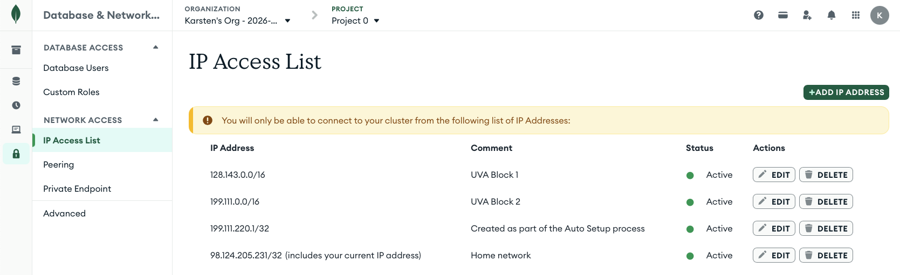
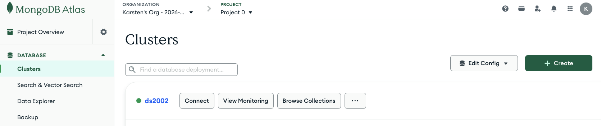

# NoSQL Databases

The goal of this activity is to familiarize you with NoSQL database systems. These databases are essential for handling unstructured data, scaling horizontally, and working with modern application architectures that require flexible data models. The primary focus is MongoDB. The sections on Redis and DynamoDB are optional. 

## MongoDB

MongoDB helped popularize the NoSQL approach and remains a favorite choice among many developers because of its speed and relative simplicity to work with. Like Redis, MongoDB tables (i.e. "collections") consist of keys and values, but the value side is made up of variable payloads of JSON. This means that one row (i.e. "record" or "document") may contain JSON with a handful of values while the next row contains dozens more. There is no requirement for records to conform to a pre-defined schema or structure.


Mongo allows developers to search across documents for specific data elements in the JSON tree and to add arbitrary documents within the same collection, with a maximum of 16MB of data per document. This allows Mongo to keep frequently-accessed documents in memory.

MongoDB's strongest features for data science are:

* Simple to use for storing varied datasets.
* Popularity in the community.
* Can be run locally, on a server, or in the cloud.
* Returns results quickly.

<a href="https://www.mongodb.com/" target="_blank" rel="noopener noreferrer"><strong>Learn more about MongoDB</strong></a>

* Before class, **set up your own MongoDB Atlas cluster in the cloud**.
* Proceed with the **In-class Exercises**.
* Optional: Explore the **Advanced Concepts** if you wish to explore NoSQL databases in more depth.

## Set up your own MongoDB Atlas Cluster in the Cloud

This course will be using MongoDB Atlas, a cloud-based Mongo service, for hands-on exercises. 

### 1. Sign up for MongoDB Atlas

Follow the instructions in the <a href="https://www.youtube.com/watch?v=5-tIfDCb-T4" target="_blank" rel="noopener noreferrer"><strong>How To video</strong></a> for setup. 

I recommend using a Google account to <a href="https://www.mongodb.com/cloud/atlas/register" target="_blank" rel="noopener noreferrer"><strong>create your Atlas MongoDB Cluster</strong></a>. But you can create an account with any valid email address.

### 2. Update the IP access list

In order to reach the MongoDB Atlas cloud service from the UVA HPC cluster (or other locations on grounds), you have to update the list of IP addresses allowed to connect to the service. This is called `whitelisting`. 

1. In the MongoDB Atlas web interface, click on `Database & Network Access` on the left-hand sidebar (grouped under `Security`).

2. On the next screen click on `IP Access List`.

3. Click the `+Add IP ADDRESS` button and add the `128.143.0.0/16` address as `UVA Block 1`. Repeat this step for the `199.111.0.0/16` address as `UVA Block 2`. In CIDR notation, the number after the slash (e.g. `/16`) is the prefix length: it indicates how many bits define the network, so `/16` allows all IPs in that network block (e.g. 128.143.0.0 through 128.143.255.255).

    The IP Access list should look similar to this:

    

    Your address entry next to `Created as part of the Auto Setup process` is likely different. The `Home network` address is not needed unless you want to access the MongoDB Atlas cluster from off-grounds.

### 3. Get Connection String (URL)

1. In the MongoDB Atlas web interface, click on `Database` > `Clusters` (left side menu). In this case the cluster is named `ds2002`. You may have chosen a different name during setup, which is fine.

    

2. Click on the `Connect` button of your cluster and select `Shell - Quickly add & update data using MongoDB's Javascript command-line interface`. This will give you a `connection string` similar to this:

    ```bash
    mongosh "mongodb+srv://ds2002.tmwdrjn.mongodb.net/" --apiVersion 1 --username <username>
    ```

    The `connection URL` is the part between the pair of `"`. In this case:
    ```bash
    mongodb+srv://ds2002.tmwdrjn.mongodb.net/
    ```
    
    **Yours will be different.**

   - If the URL extends beyond `...mongodb.net/`, delete it from the connection string.
   - Replace `<username>` with the user you created when you signed up for MongoDB Atlas.
  
  
### 4. Save Connection String

Open your `~/.bashrc` and add the following export statement:

```bash
    export MONGODB_ATLAS_URL="<YOUR_CONNECTION_URL>" # something like mongodb+srv://ds2002.tmwdrjn.mongodb.net/
    export MONGODB_ATLAS_USER="<YOUR_USERNAME>" # 
    export MONGODB_ATLAS_PWD="<YOUR_PASSWORD>" # 
``` 

## In-class exercises

### The `mongosh` CLI tool

**1. Open a new terminal**
I recommend opening a terminal on the UVA HPC system. Start an interactive `Code Server` (VSCode) session and open a terminal in VSCode.

**2. Load the needed software**
```bash
module load miniforge
source activate ds2002
module load mongosh
```

**3. Connect**     
```bash
mongosh "mongodb+srv://ds2002.tmwdrjn.mongodb.net/" --apiVersion 1 --username <username>
```
or, using the environment variables that you have set in your bashrc:
```bash
mongosh $MONGODB_ATLAS_URL --apiVersion 1 --username $MONGODB_ATLAS_USER
```

You will be prompted for your password. Enter it.

You should now be connected to the MongoDB cluster in the cloud.
```
Current Mongosh Log ID: 699e58dc0ab4a093557db299
Connecting to:          mongodb+srv://<credentials>@ds2002.tmwdrjn.mongodb.net/?appName=mongosh+1.8.0
Using MongoDB:          8.0.19 (API Version 1)
Using Mongosh:          1.8.0

For mongosh info see: https://docs.mongodb.com/mongodb-shell/

Atlas atlas-ct3ynp-shard-0 [primary] test>
```

Congrats, you're logged in to the Atlas cluster and you're ready to explore the CLI.

Type `exit` to leave the `mongosh` CLI and return to your bash shell.

**4. Explore the `sample_mflix` database**

List all databases:
```javascript
show dbs;
```
You should see this list, and possibly a few other databases:
```
sample_mflix  174.90 MiB
admin         356.00 KiB
local          12.63 GiB
```

If you don't see the `sample_mflix` database, [follow these instructions](https://www.mongodb.com/docs/atlas/sample-data/?utm_campaign=search_sample_checklist&utm_source=intercom&utm_medium=app#in---go-to-the-clusters-page-for-your-project.) to load it.

**Select database and show collections**
Now, let's switch to the `sample_mflix` database and show all its collections.
```javascript
use sample_mflix
show collections;
```

Output of available collections:
```
comments
embedded_movies
movies
sessions
theaters
users
```

**Find documents**

```javascript
db.movies.findOne()
db.movies.find().limit(3).pretty()
```

**Count and sort**

```javascript
db.movies.countDocuments()
db.movies.find().sort({ year: 1 }).limit(5).pretty()
db.movies.find().sort({ year: -1 }).limit(5).pretty()
```

### Project only some fields

The second argument to `find()` is a projection: which fields to return. Use `1` to include, `_id: 0` to omit the default `_id`. Example: movies from 2000, returning only `title` and `year`.

```javascript
db.movies.find({ year: 2000 }, { title: 1, year: 1, _id: 0 }).limit(5).pretty()
```

### Search with filters

The first argument to `find()` is the filter (query). Use a plain value for equality; use `$gt`, `$lt`, `$gte`, `$lte`, or `$ne` for comparisons; use `$or` with an array to match any of several conditions.

**Equality** (movies from 1994):

```javascript
db.movies.find({ year: 1994 }).limit(3).pretty()
```

**Comparison** (movies after 2000) and **logical OR** (movies from 1999 or 2000):

```javascript
db.movies.find({ year: { $gt: 2000 } }).limit(3).pretty()
db.movies.find({ $or: [ { year: 1999 }, { year: 2000 } ] }).limit(3).pretty()
```

### More Operators

* **Comparison Operators** ($eq, $ne, $gt, $lt, $gte, $lte, $in): Filter documents by comparing field values.

* **Logical Operators** ($and, $or, $nor, $not): Combine or invert query conditions.

* **Update Operators** ($set, $inc, $unset, $push): Modify documents, such as changing, incrementing, or adding field values.

* **Array Operators** ($all, $size, $elemMatch): Query and manipulate data within array fields.

* **Evaluation Operators** ($regex, $text, $where): Enable complex searches, including pattern matching and full-text searches.
  
### Iterators with Functions

Use `.forEach()` to run a function over each document in the result. Example: print a field with a custom prefix (using the `sample_mflix` database):

```javascript
db.movies.find({ year: 2000 }).limit(3).forEach(function(doc) {
  print("Movie: " + doc.title + " (" + doc.year + ")");
});
```
Output:
```
Movie: In the Mood for Love (2000)
Movie: State and Main (2000)
Movie: April Captains (2000)
```

### Create Operations

Let's switch gears and create your own database and collection in the Atlas Cluster. Insert operations add new documents to a collection. If the collection does not exist, MongoDB creates it. 

**Create a database and collection.** Switch to a new database; the collection is created when you first insert into it.

```javascript
use mypractice
```

**Insert one document** (`insertOne`). Use a simple document structure—e.g. `name` and `quantity`.

```javascript
db.items.insertOne({ name: "apple", quantity: 5 })
```
This creates a new collection `items` and inserts a new document into it. Let's confirm:

```javascript
show collections;
db.items.find().pretty();
```
Output:
```
[
  {
    _id: ObjectId("699e8ab1ffd8068edd5647c6"),
    name: 'apple',
    quantity: 5
  }
]
```

Note the automatic creation of the `_id` field, containing a unique identifier for your new document.  

**Insert multiple documents** (`insertMany`). Pass an array of documents.

```javascript
db.items.insertMany([
  { name: "banana", quantity: 10 },
  { name: "orange", quantity: 3 }
])
```

Verify with `db.items.find().pretty()`. See *Read Operations* below for querying.

### Read Operations

Using the `mypractice` database and `items` collection from above:

```javascript
db.items.find().pretty()
db.items.findOne({ name: "apple" })
db.items.find({ quantity: { $gte: 5 } }).pretty()
```

### Update Operations

Update one document with `updateOne`. The first object is the filter (which documents to update); the second uses `$set` to specify which field(s) to update and to what value(s). 

```javascript
db.items.updateOne({ name: "apple" }, { $set: { quantity: 8 } })
```

Update multiple documents with `updateMany`.
```javascript
db.items.updateMany({ quantity: { $lt: 10 } }, { $set: { restocked: true } })
db.items.find().pretty()
```

### Delete Operations

Remove documents with `deleteOne` (one match) or `deleteMany` (all matches). Use a filter to limit what is removed.

```javascript
db.items.deleteOne({ name: "orange" })
db.items.find().pretty()
```

### MongoDB + Python

**PyMongo** is the official MongoDB driver for Python. It lets you connect to a MongoDB server (including Atlas), run the same operations you used in the shell—insert, find, update, delete—and work with results as Python dictionaries and lists.

**Install PyMongo:**
```bash
pip install pymongo
```

**Shared connection:** `database.py` uses the same environment variables as the mongosh setup (`MONGODB_ATLAS_URL`, `MONGODB_ATLAS_USER`, `MONGODB_ATLAS_PWD`) and exposes a shared `client`, `db` (mypractice), and `items` collection for scripts that import it.

**Numbered scripts (run in order 01 → 07):**

| Script | Purpose |
|--------|---------|
| `01-sample_mflix.py` | Connect to `sample_mflix`, list collections and document counts |
| `02-mongo_setup.py` | Use shared client from `database.py`; show server version, databases, and mypractice collection counts |
| `03-mongo_create.py` | Create `mypractice` / `items` and insert sample documents (apple, banana, orange) |
| `04-mongo_read.py` | Read documents: find one, find by filter, count |
| `05-mongo_update.py` | Update documents with `$set` |
| `06-mongo_delete.py` | Delete one document and show remaining |
| `07-mongo_summary.py` | Print final summary of `mypractice` collections and `items` |

Run the sequence after setting the Atlas env vars (e.g. in your shell or `~/.bashrc`): `python3 01-sample_mflix.py` then `02-mongo_setup.py` through `07-mongo_summary.py`.

## Advanced Concepts (Optional)

### Redis

Think of Redis as an exceptionally fast, 2-column lookup table. It makes no use of schemas, relations, or indexes.

- The LEFT `key` column (metaphorically speaking) in a Redis DB stores keys. Keys can consist of any useful, unique identifier.
- The RIGHT `value` column in a Redis DB can consist of a variety of data types, such as strings, integers, lists, sets, hash tables, etc.


Redis is "fast" despite its data storage capabilities being relatively large (the `value` half has a maximum capacity of 512MB),
while the database engine attempts to keep frequently-accessed data in memory for optimal return to requests.

Redis's strongest features for data science are:

1. Incredibly simple to use.
2. Stores large records.
3. Returns results quickly.
4. Useful for storing and retrieving lists, queues, tasks, items, orchestration, settings, etc.

<a href="https://redis.io/" target="_blank" rel="noopener noreferrer"><strong>Learn more about Redis</strong></a>

#### Run Redis & Connect

The fastest way to get started is via [Redis Cloud](https://redis.io/docs/latest/get-started/) without any local installation. [Register for Redis Cloud](https://redis.io/try-free/)

Local Installation: You can install and run Redis on your own computer.
- Install Redis on Linux
- Install Redis on macOS
- Install Redis on Windows (typically via WSL2)

#### Connect and Use Client Tools 

Once your Redis instance is running, connect to it using a client tool to issue commands manually. 

- **Redis CLI:** The command-line interface is a simple and powerful way to interact with Redis.
- **Redis Insight:** A visual client tool for creating, managing, and analyzing your Redis data. It's great for visualizing data and also offers a web-based version for Redis Cloud databases.
- **VS Code Extension:** If you prefer working within your IDE, there's an official Redis for VS Code extension.

#### Redis Practice

1. List all keys:
```
KEYS *
```
1. Insert some keys using the firstnames and lastnames of people as keys and values:
```
SET jim ryan
SET tina fey
SET leonardo davinci
```
1. Fetch those values using their keys:
```
GET jim
GET leonardo
GET tina
```
1. Set 3 Key-Value pairs using integers as the value. Add expiration times in seconds:
```
SET counter1 10 EX 10 
SET counter2 472 EX 30 
SET counter3 984 EX 28 
```
Next retrieve these values by key, one by one. Repeat this process for the next minute. Can you continue to fetch these values?

1. Set up a counter and increment it. You can increment by any integer amount:
```
SET counter 1
INCRBY counter 5
INCRBY counter 5
INCRBY counter 5
GET counter
```
1. For more hands-on practice and advanced usage, see the <a href="https://redis.io/docs/develop/data-types/" target="_blank" rel="noopener noreferrer"><strong>Redis data types guide</strong></a> and <a href="https://redis.io/docs/" target="_blank" rel="noopener noreferrer"><strong>Redis docs</strong></a>. Pay particular
attention to commands like:

- `MSET` / `MGET` - setting multiple items
- `LPUSH` / `LSET` / `LRANGE` / `LREM` / `LPOP` - create and manage lists
- `ZADD` / `ZRANGE` / `ZREM` / `ZCOUNT` - create and manage sorted sets

### DynamoDB

Amazon DynamoDB is a key-value and document database that delivers single-digit millisecond performance at any scale. It's a fully managed, multi-region, multi-active, durable database with built-in security, backup and restore, and in-memory caching for internet-scale applications. DynamoDB can handle more than 10 trillion requests per day and can support peaks of more than 20 million requests per second.

DynamoDB's strongest features for data science are:

1. It "just works."
2. As a managed service there is nothing to provision or maintain.
3. Regardless of user requests it remains fast.
4. Scales to any load.

The maximum value of the `value` half of a row in DynamoDB is 400KB, which is considerably smaller than Redis or MongoDB.

#### DynamoDB Practice

For hands-on DynamoDB practice, use <a href="https://aws.amazon.com/dynamodb/getting-started/" target="_blank" rel="noopener noreferrer"><strong>AWS DynamoDB getting started</strong></a>.

## Resources

* <a href="https://www.ibm.com/think/topics/mongodb#1490489863" target="_blank" rel="noopener noreferrer">What is MongoDB</a>
* <a href="https://www.youtube.com/watch?v=5-tIfDCb-T4" target="_blank" rel="noopener noreferrer">Set up MongoDB Atlas</a>
* <a href="https://mongodb-devhub-cms.s3.us-west-1.amazonaws.com/Mongo_DB_Shell_Cheat_Sheet_1a0e3aa962.pdf" target="_blank" rel="noopener noreferrer">MongoDB CheatSheet</a>
* <a href="https://www.youtube.com/watch?v=ofme2o29ngU" target="_blank" rel="noopener noreferrer">MongoDB Crash Course</a>
* <a href="https://redis.io/docs/" target="_blank" rel="noopener noreferrer">Redis</a>
* <a href="https://aws.amazon.com/dynamodb/" target="_blank" rel="noopener noreferrer">DynamoDB</a>


