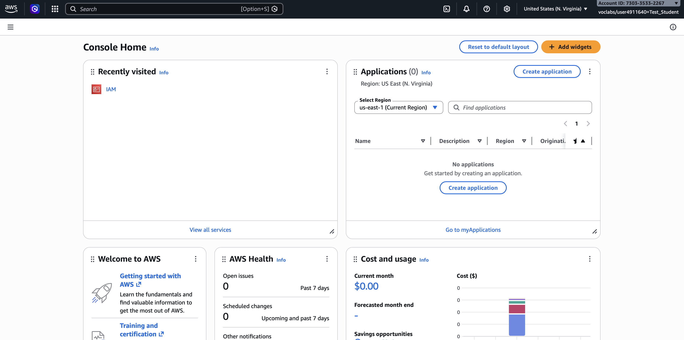
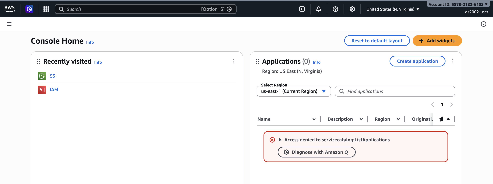
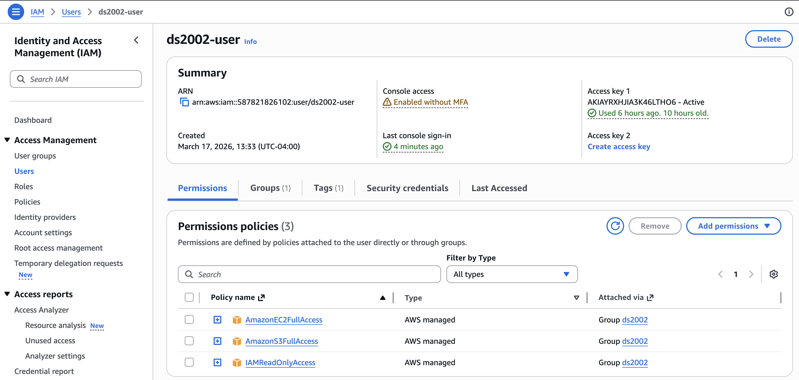

# AWS IAM and S3 Storage

The goal of this activity is to familiarize you with Amazon Identity Access & Management (IAM) and Amazon S3 storage. IAM is the central service that controls access to all other AWS services, so it is critical to have a basic understanding of how it works. S3 is one of the quintessential solutions for storing datasets, sharing files, backing up data, and building data pipelines that require reliable object storage.

You will learn how to use the web-based `AWS Management Console` and programmatically interact with AWS services via the `AWS Command Line tools` (awscli) and `boto3` Python package.

> **Note:** Work through the examples below, experimenting with each command and its various options. If you encounter an error message, don't be discouraged—errors are learning opportunities. Reach out to your peers or instructor for help when needed, and help each other when you can. 

* Start with the **In-class Exercises** which provide an introduction to IAM and S3.
* Complete [Lab 08: S3 Storage](../../labs/08-s3/).
* Continue with the **Additional Practices** section on your own time. 
* **Optional:** Explore the **Advanced Concepts** if you wish to explore cloud storage in more depth.

## In-class exercises

This week's hands-on work has two parts, **Amazon IAM** and **Amazon S3**.

### IAM

#### Step 1: Log into AWS Academy

1. You should have received an email to your UVA account with an invitation to the AWS Academy Cloud Foundations course.

2. If you haven't done so yet, follow the [AWS Academy account setup](../../setup/aws_academy.md) instructions to get your account ready.
   
#### Step 2: Review AWS Academy lab instruction

1. On the AWS Academy Canvas page, navigate to the `AWS - Cloud: ds2002-sp26` course > `Modules` > `Introduction` and review the `How to complete lab exercises` instructions.

#### Step 3: Complete **Lab: Introduction to AWS IAM**

1. On the AWS Academy Canvas page, navigate to `Modules` > `Module 4` > `Lab - 1 Introduction to AWS IAM`
   
2. Follow the lab instructions. When you click **Start Lab**. Wait until the AWS indicator light turns green. 

3. Click on the AWS link when the indicator turns green. A new browser tab should open with the `AWS Management Console`.
   

4. Submit your work in AWS Academy.

5. End the AWS Academy lab.

#### Step 4: Access AWS Management Console for ds2002

In `Practice 02` and `Lab 01` you connected to a remote server via ssh, using the `ds2002` user account. This server is hosted on AWS. Let's take a look behind the scenes and review the account setup in the AWS IAM via the AWS Management console.

1. The `AWS Console URL` and `username`, `password` for the ds2002 AWS account are posted in the Canvas assignment for `Lab 08 - Working with S3 Storage`. 

2. After logging in, you should see a screen like this:


1. Click on `IAM` to open the Identity & Access Management page.

2. Click on `Users`.

3. Click on `ds2002-user`.
   

4. On the `Permissions` tab, note the Permission policies granting:
   - AmazonEC2FullAccess
   - AmazonS3FullAccess
   - IAMReadOnlyAccess

### S3

#### Environment

The following exercises require that you have a working Python3 environment and both the AWS CLI tool (with access keys configured) and Python3 / `boto3` installed. 

1. Start a Code Server (VSCode) session in Open OnDemand on UVA's HPC system.

2. Activate your environment:
   ```bash
   module load miniforge
   source activate ds2002
   ```

3. AWS CLI and Python packages  
   The `ds2002` environment should have the AWS CLI and `boto3` packages installed. If you need to reinstall (on the HPC system or elsewhere), follow these steps:

    AWS CLI installation:  
    ```bash
    python3 -m pip install awscli
    ```
    
    `boto3` installation:
    ```bash
    python3 -m pip install boto3
    ```

#### AWS CLI configuration

You are set up as user `ds2002` in AWS. Your credentials are posted in the Canvas assignment for this lab. Look them up now. You will need:

- AWS_ACCESS_KEY
- AWS_SECRET_ACCESS_KEY

> **It is highly advised NOT to use root credentials for access in this way.**

In the terminal, follow these steps to configure the `aws` command line tools:
```bash
aws configure
```

You will be prompted to enter:
- **AWS Access Key ID**: Enter the Access Key ID (from Canvas)
- **AWS Secret Access Key**: Enter the Secret Access Key (from Canvas)
- **Default region name**: Enter your preferred AWS region (use `us-east-1`, you generally want to choose the one that's geographically closest)
- **Default output format**: Enter `json` (recommended) or `text` or `table`   

The AWS account you enter in these steps must have at least read permission to access the resources you want to download. 

Upon completion of `aws configure` you will see a hidden directory `~/.aws`. 

> **Note:** Remember, the creation of personal config files in hidden directories inside your home directory is a best-practice pattern. 

**Check the config file**

You can verify your AWS configuration by viewing the config file:
```bash
cat ~/.aws/config
cat ~/.aws/credentials
```

Or test your configuration by running:
```bash
aws sts get-caller-identity
```

This command will display in JSON format the associated AWS account ID, user ARN, and user ID, confirming that your credentials are working correctly.

It should look similar to this:
```json
{
    "UserId": "xxxxxxxxxxxxx",
    "Account": "nnnnnnnnnnnnnnn",
    "Arn": "arn:aws:iam::nnnnnnnnnnnnn:user/ds2002-user"
}
```

#### Access S3 using the AWS CLI

Now we can get busy!

### `aws s3 ls` - List Buckets
```
aws s3 ls
```
You should see a list similar to this
```
2026-03-17 13:59:08 course-read-only
2026-03-17 14:01:15 course-read-write
2026-03-17 14:09:13 ds2002-khs3z
```

#### `aws s3 mb` - Make a new bucket
```
echo $USER
aws s3 mb s3://mybucket-$USER
```
On the UVA HPC system, the $USER variable will be expanded to your computing id. We use it here to allow all students to create separate buckets without naming conflicts. You should see a response like:
```
make_bucket: mybucket-mst3k
```

Remember that S3 bucket names must be globally unique from all other AWS customers. If you receive an error that the bucket already exists, retry with a new name, e.g. mybucket-$USER-1, mybucket-$USER-2, etc..

Log into AWS Management Console. **The url and credentials are posted in Canvas assignment for `Lab 08 - Working with S3`.** Search for `S3` and click on `General Purpose Buckets`

#### `aws s3 rm` - Remove a bucket
```
aws s3 rm s3://mybucket-mst3k
```
Remember that S3 buckets must be emptied of all contents before they can be removed. Once removed the bucket name is available for other users.

#### `aws s3 ls` - List the contents of a bucket

In the example below, replace `mybucket-mst3k` with your actual bucket name.
```
aws s3 ls s3://mybucket-mst3k/
                           PRE keys/
                           PRE status/
                           PRE zip/
2020-06-26 09:50:08      10451 index.json
2020-06-26 09:50:09         64 robots.txt
```

**FOLDERS IN S3** - Contrary to how it appears, S3 is not a file system in the ordinary sense. Instead, it is a web-based, API-driven object storage
service containing KEYS and VALUES. The key (name) of a file (object) is arbitrary after the name of the bucket itself, but must obey certain rules such as
using no unusual characters. The typical form of grouping objects under "subfolders" uses the same naming convention as regular filesystems with a "key" such as: 

`mybucket1/folder/subfolder/filename.txt`

The value (contents) of that key are the actual contents of the file itself. But it is important to remember that folders as they appear in the path of
an S3 object are simply a mental convenience.

#### `aws s3 cp` - Upload a file

The general syntax is
```
aws s3 cp SOURCE DESTINATION
```

```
aws s3 cp local-file.txt s3://mybucket-$USER/
```

To upload a file and make it publicly available via HTTPS, add an `acl` property to it:
```
aws s3 cp --acl public-read local-file.txt s3://mybucket-$USER/
```

#### `aws s3 cp` - Download a file

Notice that the `aws s3 cp` command uses the same `SOURCE` and `DESTINATION` concept as the Linux `cp` command (see [Linux CLI](../02-cli/README.md)). `SOURCE` and `DESTINATION` can refer to a specific file or folder.

So to download a file the `SOURCE` is the file in the S3 bucket and the `DESTINATION` a folder in our local environment (`./` refers to the current directory you're in).
```
aws s3 cp s3://mybucket1/robots.txt ./
```

You can copy between any source/destination so long as at least one of them is S3:

- Copy from local environment to S3
- Copy from S3 to local environment
- Copy from S3 bucket to another S3 bucket

#### `aws s3 sync` - Synchronize to/from an S3 bucket
```
aws s3 sync ./local-dir s3://mybucket1/remote-dir/
```
You can synchronize between any source/destination so long as at least one of them is S3:

- Sync from local workstation to S3
- Sync from S3 to local workstation
- Sync from S3 bucket to another S3 bucket

#### `aws s3 rm` - Remove a file from S3
```
aws s3 rm s3://mybucket1/file-not-wanted.pdf
```

#### `aws s3 mv` - Move a file within S3
```
aws s3 mv s3://mybucket1/original-file.csv s3://mybucket1/moved-file.csv
```

#### `aws s3 presign` - Presign an S3 URL

In some cases users want to share a file with a remote party without creating access keys or for a limited amount of time. The `presign` feature
is useful in this case since it creates a unique signed URL that expires after a set amount of time. 

To set the expiry time, calculate the length of time you want the signature to last in seconds. This value will be used with the `--expires-in` flag.

```
aws s3 presign --expires-in 600 s3://mybucket1/path/file-to-share.tar.gz

https://mybucket1.s3.amazonaws.com/path/file-to-share.tar.gz?AWSAccessKeyId=AKICMAJHNXKQDLN34VZJ&Signature=sCH2pRjn7M02P5D8JnAyBq%2FP7kQ%3D&Expires=1593196195

```


### Access S3 using `boto3` in Python

The `boto3` package is the standard library enabling programmatic access to AWS using Python. `boto3` can access all AWS services and is helpful for creating,
managing, or removing remote resources and infrastructure dynamically. The steps below refer to using `boto3` for working with files in S3.

`boto3` will obtain its credentials from one of a few various locations:

- Hard-coded credentials within the application code itself. **This is bad security practice and not recommended!**
- Inherited credentials from the `~/.aws/` directory within your home directory. This is common for remote development.
- Injected as environment variables of the environment in which your code is running.
- Inherited credentials from the IAM role of the EC2 instance running your code. This is a best practice for production systems in AWS.

#### Install `boto3`

```bash
python -m pip install boto3
```

Confirm with
```bash
python -c "import boto3"
```

If you don't receive an error message, the `boto3` package was found in your current environment.

#### Use `boto3`

Import the library as you would for any other Python package, and set up a client or resource for the AWS service:
```python
import boto3

s3 = boto3.client('s3')
```

#### Pass credentials via env variables

In the shell that's executing the Python script, define environment variables for your AWS credentials.

```bash
export MY_ACCESS_KEY="YOUR_KEY"
export MY_SECRET_ACCESS_KEY="YOUR_SECRET"
```

Then execute your Python script, which may look like this:
```python
import os
import boto3

# Assume the following environment variables are set:
# export MY_ACCESS_KEY="YOUR_KEY"
# export MY_SECRET_ACCESS_KEY="YOUR_SECRET"

ACCESS_KEY = os.getenv('MY_ACCESS_KEY')
SECRET_ACCESS_KEY = os.getenv('MY_SECRET_ACCESS_KEY')
s3 = boto3.client(
    "s3", 
    aws_access_key_id=ACCESS_KEY, 
    aws_secret_access_key=SECRET_ACCESS_KEY)
```

#### Create a bucket

```python
import boto3

bucket_name = "ds2002-mst3k"  # replace with your bucket name
s3 = boto3.client("s3", region_name="us-east-1")
s3.create_bucket(
    Bucket=bucket_name,
    CreateBucketConfiguration={"LocationConstraint": "us-east-1"},
)
```

#### Delete a bucket

```python
import boto3

bucket_name = "ds2002-mst3k"  # replace with your bucket name
s3 = boto3.client("s3")
s3.delete_bucket(Bucket=bucket_name)
```

>**Note:** Buckets have to be empty before they can be deleted.

#### Upload a file to S3

```python
import boto3

bucket_name = "ds2002-mst3k"  # replace with your bucket name
local_file = "cloud.jpg"
key = "cloud.jpg"            # path in bucket (prefix/filename)

s3 = boto3.client("s3")
with open(local_file, "rb") as f:
    s3.put_object(Bucket=bucket_name, Key=key, Body=f)
```

#### Download a file from S3

```python
import boto3

bucket_name = "ds2002-mst3k"  # replace with your bucket name
key = "cloud.jpg"
local_file = "downloaded-cloud.jpg"
s3 = boto3.client("s3")

obj = s3.get_object(Bucket=bucket_name, Key=key)
# save the object, "wb" stands for write binary
with open(local_file, "wb") as f:
    f.write(obj["Body"].read())
```

#### Deleting files in S3

```python
import boto3

s3 = boto3.client("s3")
bucket_name = "ds2002-mst3k"  # replace with your bucket name
key = "cloud.jpg"

s3.delete_object(Bucket=bucket_name, Key=key)
```

#### Access control lists (ACLs)


#### Catching boto exceptions

Most S3 errors show up as a `botocore.exceptions.ClientError`. For the simplest demos above, we omit error handling so you can focus on the API calls.

See the Python script files for additional examples (including error handling patterns).

## Advanced Concepts (Optional)

### IAM

#### Policies

Example (bucket policy that allows read-only access to everything in a bucket):

```json
{
  "Version": "2012-10-17",
  "Statement": [
    {
      "Effect": "Allow",
      "Principal": "*",
      "Action": ["s3:GetObject"],
      "Resource": "arn:aws:s3:::YOUR-BUCKET-NAME/*"
    }
  ]
}
```

Example (least-privilege IAM policy that only allows uploads to one prefix):

```json
{
  "Version": "2012-10-17",
  "Statement": [
    {
      "Effect": "Allow",
      "Action": ["s3:PutObject"],
      "Resource": "arn:aws:s3:::YOUR-BUCKET-NAME/book-analysis/*"
    }
  ]
}
```

#### AWS STS + temporary credentials

Example (conceptual flow):

- Create a role with an S3 policy attached.
- Call `sts:AssumeRole` to get temporary credentials.
- Use those temporary credentials in the AWS CLI or `boto3` instead of long-lived access keys.

**AWS CLI — one-off `assume-role`**

```bash
aws sts assume-role \
  --role-arn arn:aws:iam::123456789012:role/YOUR_ROLE_NAME \
  --role-session-name ds2002-session
```

The JSON output includes `AccessKeyId`, `SecretAccessKey`, and `SessionToken`. Export those as environment variables (or paste into a new shell) to run further `aws` commands as that role.

**AWS CLI — profile that assumes a role** (recommended)

Add to `~/.aws/config` (use your real account ID and role name; `source_profile` is the profile whose user may call `sts:AssumeRole`):

```text
[profile my-assumed-role]
role_arn = arn:aws:iam::123456789012:role/YOUR_ROLE_NAME
source_profile = default
region = us-east-1
```

Then:

```bash
aws s3 ls --profile my-assumed-role
```

The CLI calls STS for you when you use that profile.

**boto3 — explicit `assume_role`**

```python
import boto3

sts = boto3.client("sts")
resp = sts.assume_role(
    RoleArn="arn:aws:iam::123456789012:role/YOUR_ROLE_NAME",
    RoleSessionName="ds2002-session",
)
creds = resp["Credentials"]

s3 = boto3.client(
    "s3",
    aws_access_key_id=creds["AccessKeyId"],
    aws_secret_access_key=creds["SecretAccessKey"],
    aws_session_token=creds["SessionToken"],
)
print(s3.list_buckets())
```

**boto3 — same as the CLI profile**

If you defined `my-assumed-role` in `~/.aws/config` as above:

```python
import boto3

session = boto3.Session(profile_name="my-assumed-role")
s3 = session.client("s3")
print(s3.list_buckets())
```

#### Multiple AWS profiles

You can keep credentials for several AWS accounts and users side by side using named profiles in `~/.aws/credentials` and `~/.aws/config`.

Example (`~/.aws/credentials`):

```text
[default]
aws_access_key_id = YOUR_DEFAULT_ACCESS_KEY
aws_secret_access_key = YOUR_DEFAULT_SECRET_KEY

[ds2002]
aws_access_key_id = YOUR_DS2002_ACCESS_KEY
aws_secret_access_key = YOUR_DS2002_SECRET_KEY
```

Example (`~/.aws/config`):

```text
[default]
region = us-east-1

[profile ds2002]
region = us-east-1
```

Use a specific profile with the AWS CLI:

```bash
aws s3 ls --profile ds2002
```

And in `boto3`:

```python
import boto3

session = boto3.Session(profile_name="ds2002")
s3 = session.client("s3")
print(s3.list_buckets())
```

### S3

#### Versioning + lifecycle policies

Example (lifecycle rules are configured as bucket lifecycle JSON). Common patterns:

- Delete incomplete multipart uploads after N days.
- Expire objects in a prefix after N days.
- Transition objects to cheaper storage classes after N days.

#### S3 event notifications

Example (typical event-driven pipeline):

- S3 `ObjectCreated` event on a prefix (e.g., `book-analysis/`)
- Triggers one of: **Lambda**, **SQS**, or **SNS**
- Your handler reads the new object and runs processing

#### Access logging & auditing

Examples:

- **CloudTrail data events** for S3: see who accessed which objects (read/write).
- **S3 server access logs**: deliver access logs to a separate logging bucket for analysis.

## Resources

- [Amazon IAM - Getting started](https://docs.aws.amazon.com/IAM/latest/UserGuide/getting-started.html)
- [Amazon S3 - Getting started](https://docs.aws.amazon.com/AmazonS3/latest/userguide/GetStartedWithS3.html)
- [AWS CLI - Getting started](https://docs.aws.amazon.com/cli/latest/userguide/cli-chap-getting-started.html)
- [Boto3 Documentation](https://docs.aws.amazon.com/boto3/latest/)
- [Boto3 and S3](https://boto3.amazonaws.com/v1/documentation/api/latest/reference/services/s3.html)
