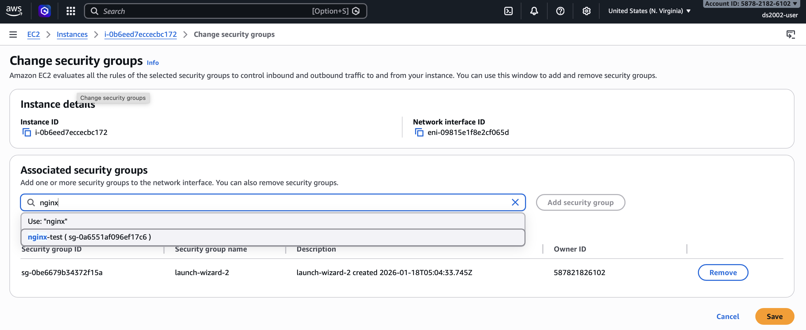

# Cloud Computing

The goal of this activity is to familiarize you with cloud computing concepts and services. Cloud computing is essential for scalable data processing, accessing powerful computing resources on-demand, and building modern data science infrastructure.

If the initial examples feel easy, challenge yourself with the *Advanced Concepts* section and the resource links at the end of this document.

* Start with the **In-class exercises**, which introduce Amazon EC2 (console and CLI).
* Complete [Lab 09: EC2](../../labs/09-ec2/).
* Continue with **Additional Practice** (Python scripts) on your own time.
* **Optional:** Explore the **Advanced Concepts** if you wish to go deeper into EC2, EBS, and related topics.

## In-class exercises

### Managing EC2 instances in AWS Console

#### Step 1: Log into AWS Academy

1. You should have received an email to your UVA account with an invitation to the AWS Academy Cloud Foundations course.

2. If you haven't done so yet, follow the [AWS Academy account setup](../../setup/aws_academy.md) instructions to get your account ready.

#### Step 2: Complete the **Introduction to Amazon EC2** lab

1. On the AWS Academy Canvas page, navigate to `Modules` > `Module 6 - Compute` > `Lab 3 Introduction to Amazon EC2`

2. Follow the lab instructions. When you click **Start Lab**, wait until the AWS indicator light turns green.

3. Click on the AWS link when the indicator turns green. A new browser tab should open with the `AWS Management Console`.
   

4. Submit your work in AWS Academy.

5. End the AWS Academy lab.

## Additional Practice

### Managing Amazon EC2 instances from the command line

Creating an Amazon EC2 instance from the command line is primarily done using the `aws ec2 run-instances` command. Before running this command, you must have the AWS CLI installed and configured with your credentials.

#### Prerequisites

**AWS IAM user**

For the shared course account you use the `ds2002-user` setup from Lab 08; for a personal account, see [Create AWS IAM user](../../setup/aws-iam-user.md).

**AWS CLI setup**

The `aws` CLI must be installed and configured (credentials and default region). Follow [Lab 08: Setup](../../labs/08-s3/README.md#setup) (environment, `aws configure`, and optional `boto3`).

#### Step 1: Gather AWS identifiers
You will need to gather several identifiers from your AWS environment before launching:
- AMI ID: The *Amazon Machine Image* ID (e.g., ami-0abcdef1234567890).
- Instance Type: The hardware specification (e.g., t2.micro).
- Subnet ID: The ID of the VPC subnet where the instance will reside.
- Security Group ID: One or more security group IDs to control traffic.
- Key Pair Name: The name of the SSH key pair for logging in.

**Where to find these identifiers in the AWS Console:**

- **AMI ID**: 
  - Go to **EC2** → **AMIs** in the left sidebar
  - Browse available AMIs or search for "Ubuntu" (e.g., "Ubuntu Server 22.04 LTS")
  - Copy the AMI ID (starts with `ami-`)
  
- **Instance Type**: 
  - When launching an instance, you'll see a list of instance types
  - For learning purposes, `t2.micro` or `t3.micro` are often eligible for the AWS Free Tier
  - See [EC2 Instance Types](https://aws.amazon.com/ec2/instance-types/) for details
  
- **Subnet ID**: 
  - Go to **VPC** → **Subnets** in the AWS Console
  - Select a subnet in your desired availability zone
  - Copy the Subnet ID (starts with `subnet-`)
  
- **Security Group ID**: 
  - Go to **EC2** → **Security Groups**
  - Create a new security group or use an existing one
  - Ensure it allows SSH (port 22) from your IP address so that you can connect via SSH from the command line
  - Copy the Security Group ID (starts with `sg-`)
  
- **Key Pair Name**: 
  - Go to **EC2** → **Key Pairs**
  - Create a new key pair or use an existing one
  - Download the `.pem` file and store it securely
  - Note the key pair name (you'll use this in the command)
  - Change file permissions to read-only by user (you)
     ```bash
     chmod 400 MyKeyPair.pem  # replace name with actual filename
     ```

#### Step 2: Core CLI command
The basic syntax for launching a single instance is:

```bash
aws ec2 run-instances \
    --image-id ami-0abcdef1234567890 \
    --instance-type t2.micro \
    --key-name MyKeyPair \
    --security-group-ids sg-0123456789abcdef0 \
    --subnet-id subnet-0123456789abcdef0 \
    --count 1
```
> **Note:** Replace all placeholder values (AMI ID, instance type, key pair **name**, security group ID, subnet ID) with your actual AWS values. **`--key-name`** is the key pair name in EC2 (e.g. `MyKeyPair`), not the path to the `.pem` file.

We do not need to set the virtual private cloud ID (VPC ID): `--subnet-id` already picks the VPC (each subnet is tied to one VPC, so the instance is launched in that VPC automatically). In addition, `--security-group-ids` must reference security groups in that same VPC.

**Useful optional parameters**

- **Tagging:** add a `Name` tag so the instance is easy to spot in the console, for example:
  ```bash
  --tag-specifications 'ResourceType=instance,Tags=[{Key=Name,Value=MyServer}]'
  ```
  Example using your Linux username in the tag value (paste as one argument to `run-instances`):
  ```bash
  --tag-specifications 'ResourceType=instance,Tags=[{Key=Name,Value=ds2002-'"$USER"'}]'
  ```
- **User data:** pass a script to run on **first boot** (bootstrapping). Use `--user-data file://bootstrap.sh` (see [User Data & Bootstrapping](#user-data-bootstrapping)). Optional.
- **Monitoring:** enable detailed CloudWatch monitoring:
  ```bash
  --monitoring "Enabled=true"
  ```
  **What is CloudWatch monitoring?** Amazon CloudWatch collects metrics and logs from your EC2 instances. By default, EC2 instances have basic monitoring (free) which collects metrics at 5-minute intervals. Enabling detailed monitoring collects metrics at 1-minute intervals, providing more granular data for performance analysis and troubleshooting. Note that detailed monitoring incurs additional charges. For learning purposes, basic monitoring is usually sufficient.

#### Post-launch steps

**Check status:** verify the instance state (`pending`, `running`, etc.):

```bash
aws ec2 describe-instances --instance-ids <instance-id>
```

**Connect via SSH:** once the status is `running`, retrieve the public IP and connect with your private key (`.pem` file):
```bash
# Get the public IP address
aws ec2 describe-instances --instance-ids <instance-id> --query 'Reservations[0].Instances[0].PublicIpAddress' --output text

# Connect via SSH (use ubuntu as the username for Ubuntu AMIs)
ssh -i "MyKeyPair.pem" ubuntu@<public-ip-address>
```

#### SSH into your instance

1. **Find your instance ID** if you do not have it yet: in the AWS Console go to **EC2 → Instances**, select your instance, and copy **Instance ID**. From the CLI you can list running instances with `aws ec2 describe-instances --query 'Reservations[*].Instances[*].[InstanceId,State.Name,PublicIpAddress]' --output table`.
2. Run the **Post-launch steps** commands above: use `describe-instances` to get the **public IP**, then `ssh -i "MyKeyPair.pem" ubuntu@<public-ip-address>` (replace the key filename and IP). On first connect, type `yes` when prompted to trust the host key.
3. **If SSH fails with “Permission denied (publickey)”**: confirm the key path (`-i`), that the `.pem` permissions are `chmod 400`, that you use `ubuntu` for Ubuntu AMIs (or `ec2-user` for Amazon Linux), and that your security group allows **inbound TCP 22** from your current public IP.
4. After login, run `hostname` or `whoami` to confirm you are on the EC2 instance as `ubuntu` before continuing to **Perform system admin tasks** below.

#### Perform system admin tasks

After you SSH into your instance, work through these basic system administration tasks. Full reference: [Basic sysadmin tasks for a new EC2 instance](https://gist.github.com/nmagee/c43a3b4c76f460d59c3f9181b9582e45) (nmagee).

**Software**

```bash
sudo apt update
sudo apt upgrade -y
sudo apt install -y <package-name>
```

Try installing **`ncal`** (provides the `cal` command), **`python3-boto3`**, and **`sudoku`**. There is no Ubuntu package literally named `cal`; use `ncal` or install `bsdextrautils` if you only want `/usr/bin/cal`.

```bash
sudo apt install -y ncal python3-boto3 sudoku
```

Or install them one at a time (replace `<package-name>` in the generic example above with each name in turn).

**Timezone**

```bash
sudo tzselect
```

**Inspect disk usage / file size**

```bash
df -h
sudo du -sh /*
sudo du -sh /home/ubuntu/largefile.tar.gz
```

**View processes**

```bash
top
# optional: sudo apt install -y htop && htop
```

Stop a runaway process with `kill -9 <PID>` (use the PID from `top` or `htop`). Hit `q` on your keyboard to exit `top`.

**Add a user**

```bash
sudo adduser mst3k
```

Even with a password set, users cannot SSH with a password by default; SSH keys are required. Set up `authorized_keys` for the new account (commands below run after `sudo su - mst3k`, or adjust paths if you use another username):

```bash
sudo su - mst3k
cd ~
mkdir .ssh
chmod 700 .ssh
touch .ssh/authorized_keys
chmod 600 .ssh/authorized_keys
chown mst3k:mst3k .ssh/authorized_keys
```

Then paste the **public** SSH key for `mst3k` into the first line of `~/.ssh/authorized_keys` (while still logged in as `mst3k`, or use `sudo nano /home/mst3k/.ssh/authorized_keys` from `ubuntu`).

**Connect as new user `mst3k`**

After you have added `mst3k`’s public key to `/home/mst3k/.ssh/authorized_keys`, SSH using the same key pair and public IP as before, but with the new username:

```bash
ssh -i MyKeyPair.pem mst3k@<public-ip-address>
```

Replace `MyKeyPair.pem` with your key file name and `<public-ip-address>` with the instance’s public IP (the same value you used for `ubuntu@`). If connection is refused, confirm the key is on a single line in `authorized_keys`, permissions are `700` on `.ssh` and `600` on `authorized_keys`, and the security group still allows SSH (port 22) from your IP.

#### Run a simple web service (Nginx)

This is a minimal pattern for “something listening on the network” after you have an Ubuntu instance (same idea extends [Lab 09: EC2](../../labs/09-ec2/README.md)).

1. **Security group:** the default “SSH only” group blocks browsers.
   - In **EC2 → Instances**, select your EC2 instance, then go to `Actions → Security → Change Security Groups`.
   - In the `Associated security groups` search box, enter `nginx` and select the security group that pops up. This security group was created for you in the ds2002-user account. If you use your own AWS account, you'll need to create the security group yourself first.
   
   - Click `Add security group`.

2. **On the instance** (SSH as `ubuntu`):

   ```bash
   sudo apt update
   sudo apt install -y nginx
   sudo systemctl enable --now nginx
   curl -s -o /dev/null -w "%{http_code}\n" http://127.0.0.1/
   ```

   You should see `200`.

3. **From your laptop:** open `http://<public-ip>/` in a browser (use the instance’s **public** IPv4 from the console or `describe-instances`). You should get the default Nginx welcome page.

To remove the service later: `sudo apt remove -y nginx` (optional). If you attached a separate security group for HTTP, remove that association or delete the inbound **HTTP (port 80)** rule when you no longer need it.

#### Resizing an instance

To give a running VM **more or less CPU/RAM**, change its **instance type** (for example from `t2.nano` to `t2.micro` after you hit memory limits on a workload from [Lab 09: EC2](../../labs/09-ec2/README.md)). The root disk is separate; growing **EBS volume size** is covered in [Add storage (EBS volume)](#add-storage-ebs-volume) below.

**AWS Management Console**

1. Open **EC2 → Instances**, select your instance.
2. **Instance state → Stop instance** and wait until **State** is `stopped` (you cannot change type while the instance is running).
3. **Actions → Instance settings → Change instance type**, choose the new type, then **Apply**.
4. **Instance state → Start instance**. Confirm SSH still works; the **public IP may change** unless you use an Elastic IP.

**AWS CLI** (replace `i-…` and the type; same stop → change → start sequence):

```bash
aws ec2 stop-instances --instance-ids i-0123456789abcdef0
# Wait until State.Name is "stopped" (describe-instances or console).
aws ec2 modify-instance-attribute \
  --instance-id i-0123456789abcdef0 \
  --instance-type Value=t2.micro
aws ec2 start-instances --instance-ids i-0123456789abcdef0
```

Your account must be allowed to launch the target instance type in that Availability Zone. If **Change instance type** is grayed out, check that the instance is fully stopped and that the new type is supported on the same hardware/Nitro platform.

#### Terminate instance

To avoid ongoing charges, terminate the instance when finished:
```bash
aws ec2 terminate-instances --instance-ids <instance-id>
```

For a complete list of `run-instances` options, see the [AWS CLI reference for `ec2 run-instances`](https://docs.aws.amazon.com/cli/latest/reference/ec2/run-instances.html).

### Managing Amazon EC2 instances with Python (`boto3`)

Runnable examples live in this folder (same `boto3` setup as [Practice 09](../09-iam-s3/README.md#access-s3-using-boto3-in-python): default credentials chain).

1. **`01-list-instances.py`** — print every instance the account can see (`describe_instances`). Each line: instance id, state, type, public IP (or `-`), Name tag. Set `REGION` at the top of the file, then run:

   ```bash
   python3 01-list-instances.py
   ```

2. **`02-create-security-group.py`** — create a new security group in a VPC and open SSH (port 22). Prints the new `sg-…` id (group names must be unique per VPC). Edit `REGION`, `VPC_ID`, `GROUP_NAME`, and related constants at the top, then run `python3 02-create-security-group.py`.

3. **`03-launch-instance.py`** — launch a single instance into an existing subnet using one or more security groups. Edit the constants at the top (`IMAGE_ID`, `SUBNET_ID`, `SECURITY_GROUP_IDS`, etc.). Set `USER_DATA_FILE` to a path like `bootstrap.sh` to pass user data, or leave it `""` (see [User Data & Bootstrapping](#user-data-bootstrapping)). Then run `python3 03-launch-instance.py`.

4. **`04-terminate-instances.py`** — terminate the instance IDs listed in `INSTANCE_IDS` at the top of the file. Irreversible—confirm IDs with `01-list-instances.py`, `aws ec2 describe-instances`, or the console first. Then run `python3 04-terminate-instances.py`.

Core API calls use **keyword arguments** with **PascalCase** keys (`ImageId`, `MinCount`, `MaxCount`, …), not JSON-style strings.

## Advanced Concepts (Optional)

### Add storage (EBS volume)

**Amazon EBS (Elastic Block Store)** provides durable, **block-level** volumes you attach to an EC2 instance in the same **Availability Zone**. The OS sees them as disks (`/dev/xvdf`, NVMe devices, etc.): you format a filesystem, mount directories, and read/write random blocks—much like a USB drive or server disk. EBS is the usual place for boot disks and extra data on VMs. By contrast, **S3** in [Practice 09](../09-iam-s3/README.md) is **object** storage (buckets, keys, HTTP-style GET/PUT)—not a mountable block device for a single running instance.

1. Find the availability zone (AZ) for your instance (AWS Console → EC2 → instance details).
2. Create an additional EBS volume in that AZ (AWS Console → EC2 → Volumes).
3. Attach the volume to your instance (AWS Console).
4. From a terminal, SSH to the instance and check attachment with `sudo fdisk -l` or `lsblk`. Note the device name (e.g. `/dev/xvdf` or `/dev/nvme1n1` on newer instance types).
5. Create a mount point (usually under `/mnt`):

   ```bash
   sudo mkdir -p /mnt/vol2
   ```

6. Format the volume (use the device you saw in step 4):

   ```bash
   sudo mkfs -t ext4 /dev/xvdf
   ```

7. Mount the formatted device:

   ```bash
   sudo mount /dev/xvdf /mnt/vol2
   ```

8. Verify with `df -h`. Create and delete a test file under `/mnt/vol2`.
9. Manual mounts do not persist after reboot. To mount automatically, add a line to `/etc/fstab` (edit with `sudo nano /etc/fstab`):

   ```text
   /dev/xvdf   /mnt/vol2   ext4   defaults,nofail   0   2
   ```

   Use your actual device path if it differs.

### User Data & Bootstrapping

When you launch an instance, **user data** is a blob of text stored with the instance metadata. On common Linux AMIs (Ubuntu, Amazon Linux), if that text begins with `#!` (a shebang), it is typically run **once as root on first start**—a simple way to **bootstrap** the machine (install software, write config, enable services) before you SSH in.

Use the same AWS CLI configuration and region you used in [Practice 09 (IAM & S3)](../09-iam-s3/README.md#aws-cli-configuration). The `file://` path is read on **your** machine when you run `aws ec2 run-instances`, not on the instance.

**Example — Ubuntu AMI:** save the following as `bootstrap.sh` in your current directory:

```bash
#!/bin/bash
set -eux
export DEBIAN_FRONTEND=noninteractive
apt-get update -y
# Matches the Python examples in Practice 09 (boto3); use python3-pip + pip if you prefer
apt-get install -y python3-boto3
python3 -c "import boto3; print('boto3', boto3.__version__)" >> /var/log/bootstrap-user-data.log
echo "bootstrap finished at $(date -u)" >> /var/log/bootstrap-user-data.log
```

Launch with user data (add your real AMI, network, and key values):

```bash
aws ec2 run-instances \
    --image-id ami-0abcdef1234567890 \
    --instance-type t2.micro \
    --key-name MyKeyPair \
    --security-group-ids sg-0123456789abcdef0 \
    --subnet-id subnet-0123456789abcdef0 \
    --count 1 \
    --user-data file://bootstrap.sh
```

After the instance is `running`, SSH in and read `/var/log/bootstrap-user-data.log`, or run `python3 -c "import boto3"`. User data does **not** run again on ordinary reboots; to re-run setup you would need a new instance or a different automation tool (e.g. Systems Manager).

On **Amazon Linux**, replace the `apt-get` / `DEBIAN_FRONTEND` block with the appropriate `dnf` or `yum` commands for that AMI.

### Tagging your EC2 instance

**Tags** are key/value strings attached to an instance (and other AWS resources). The **`Name`** tag is what the EC2 console shows in the “Name” column—without it, you only see the instance ID. Other tags are optional (for example `Project`, `Owner`, `Environment`) and can help with filtering, billing reports, and IAM policies.

**Console:** select the instance → **Tags** tab → **Manage tags** → add `Name` and any other keys → save.

**At launch (AWS CLI):** pass one or more tags in a single specification (repeat `ResourceType=instance,Tags=[...]` if you need multiple tag-spec blocks):

```bash
aws ec2 run-instances \
  --image-id ami-0123456789abcdef0 \
  --instance-type t2.micro \
  --key-name MyKeyPair \
  --security-group-ids sg-0123456789abcdef0 \
  --subnet-id subnet-0123456789abcdef0 \
  --count 1 \
  --tag-specifications 'ResourceType=instance,Tags=[{Key=Name,Value=ds2002-mst3k},{Key=Course,Value=ds2002}]'
```

**After the instance exists:** use the instance ID from `describe-instances` or the console:

```bash
aws ec2 create-tags \
  --resources i-0123456789abcdef0 \
  --tags Key=Name,Value=ds2002-mst3k Key=Course,Value=ds2002
```

Tag keys are case-sensitive. For the same pattern as S3 bucket naming in [Practice 09](../09-iam-s3/README.md), many students use a **`Name`** like `ds2002-<computing id>` (see [Lab 09: EC2](../../labs/09-ec2/README.md)).

### Serverless computing with AWS Lambda

**AWS Lambda** runs short functions on demand without you managing a server.

**Supported languages:** 

Lambda provides **managed runtimes** for widely used stacks, including **Node.js**, **Python**, **Ruby**, **Java**, and **.NET** (each major language version maps to a runtime identifier such as `python3.12` or `nodejs22.x`). For **Go**, **Rust**, and other compiled languages, you typically use an **OS-only** (`provided`) runtime and ship a bootstrap binary; you can also supply a **custom runtime** or deploy the function as a **container image**. Supported versions and deprecation dates change over time—see the official table: [Lambda runtimes](https://docs.aws.amazon.com/lambda/latest/dg/lambda-runtimes.html).

**What can trigger a function?** 

Besides your own code calling Lambda through the AWS SDK, many services can start a run in two main ways. **Event-driven triggers** *push* JSON events when something happens (for example **Amazon S3** object creates, **SNS** notifications, **EventBridge** rules and schedules, **API Gateway** or **Application Load Balancer** HTTP requests, **CloudWatch Logs** subscription filters, **Cognito**, **SES** inbound mail, **Config**, **IoT**, **CodePipeline**, **Step Functions** tasks, and **CloudFormation** custom resources). **Event source mappings** make Lambda *poll* a stream or queue (**SQS**, **Kinesis**, **DynamoDB** streams, **MSK** / self-managed Kafka, **Amazon MQ**, **DocumentDB**). Invocations can be **synchronous** (the caller waits for your return value) or **asynchronous** (Lambda queues the event). AWS maintains an authoritative table of integrations: [Invoking Lambda with events from other AWS services](https://docs.aws.amazon.com/lambda/latest/dg/lambda-services.html).

**Example:** 

S3 can **invoke** a function automatically when objects are created (or deleted)—a common pattern for “file landed in a bucket → process it.” This ties naturally to the buckets and uploads you used in [Practice 09 (IAM & S3)](../09-iam-s3/README.md); see also [S3 event notifications](../09-iam-s3/README.md#s3-event-notifications).

**Minimal handler (Python 3.x)** — logs each object’s bucket and key. Paste into the Lambda console *Code* tab, or save as `lambda_function.py` and upload as a `.zip` containing only that file:

```python
import json

def lambda_handler(event, context):
    """React to S3 ObjectCreated* notifications."""
    for record in event.get("Records", []):
        if record.get("eventSource") != "aws:s3":
            continue
        bucket = record["s3"]["bucket"]["name"]
        key = record["s3"]["object"]["key"]
        # CloudWatch Logs shows this when the function runs
        print(f"S3 event: s3://{bucket}/{key}")
    return {"statusCode": 200, "body": json.dumps({"processed": len(event.get("Records", []))})}
```

**Wire it up (console, high level):**

1. **Lambda** → Create function → choose a Python runtime → paste the code above → **Deploy**.
2. Under **Triggers** → **Add trigger** → **S3** → pick a bucket (for example one you created in Practice 09) → Event types: **All object create events** (or a subset such as `PUT`) → save. The console adds the permissions S3 needs to invoke your function.
3. Upload a small test file to that bucket prefix (same region as the function). Open **Monitor** → **View CloudWatch Logs** and confirm you see the `S3 event: s3://…` lines.

For a real pipeline you would add **error handling**, **idempotency** (S3 may retry deliveries), and often **S3 GetObject** permissions on the function role if the code must read file contents—the snippet above only uses metadata present in the event.

## Resources

- [Launch Your Instance](https://docs.aws.amazon.com/AWSEC2/latest/UserGuide/LaunchingAndUsingInstances.html)

- [Amazon EC2 Instance Types](https://aws.amazon.com/ec2/instance-types)

- [Amazon Machine Images (AMI)](https://docs.aws.amazon.com/AWSEC2/latest/UserGuide/AMIs.html)

- [Run commands on your Linux instance at launch (user data)](https://docs.aws.amazon.com/AWSEC2/latest/UserGuide/user-data.html)

- [Root volumes for your Amazon EC2 instances](https://docs.aws.amazon.com/AWSEC2/latest/UserGuide/RootDeviceStorage.html)

- [Tag your Amazon EC2 resources](https://docs.aws.amazon.com/AWSEC2/latest/UserGuide/Using_Tags.html)

- [Amazon EC2 security groups](https://docs.aws.amazon.com/AWSEC2/latest/UserGuide/ec2-security-groups.html)

- [Amazon EC2 key pairs and instances](https://docs.aws.amazon.com/AWSEC2/latest/UserGuide/ec2-key-pairs.html)

- [Status checks for Amazon EC2 instances](https://docs.aws.amazon.com/AWSEC2/latest/UserGuide/monitoring-system-instance-status-check.html)

- [Retrieve instance console output](https://docs.aws.amazon.com/AWSEC2/latest/UserGuide/instance-console-console-output.html)

- [Instance lifecycle (reboot, stop, start, terminate)](https://docs.aws.amazon.com/AWSEC2/latest/UserGuide/ec2-instance-lifecycle.html)

- [View CloudWatch metrics for your instances](https://docs.aws.amazon.com/AWSEC2/latest/UserGuide/viewing_metrics_with_cloudwatch.html)

- [Change the Amazon EC2 instance type](https://docs.aws.amazon.com/AWSEC2/latest/UserGuide/ec2-instance-resize.html)

- [Stop and start Amazon EC2 instances](https://docs.aws.amazon.com/AWSEC2/latest/UserGuide/Stop_Start.html)

- [Amazon EC2 service quotas](https://docs.aws.amazon.com/AWSEC2/latest/UserGuide/ec2-resource-limits.html)

- [Terminate Amazon EC2 instances](https://docs.aws.amazon.com/AWSEC2/latest/UserGuide/terminating-instances.html)

- [Change instance termination protection](https://docs.aws.amazon.com/AWSEC2/latest/UserGuide/Using_ChangingDisableAPITermination.html)

- [Using AWS Lambda with Amazon S3](https://docs.aws.amazon.com/lambda/latest/dg/with-s3.html)

- [Invoking Lambda with events from other AWS services](https://docs.aws.amazon.com/lambda/latest/dg/lambda-services.html)

- [Lambda runtimes](https://docs.aws.amazon.com/lambda/latest/dg/lambda-runtimes.html)