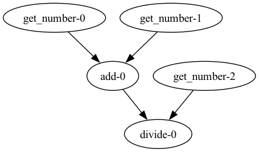
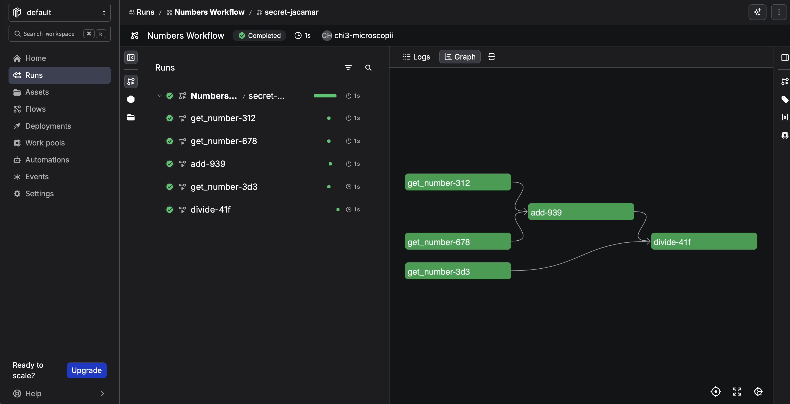
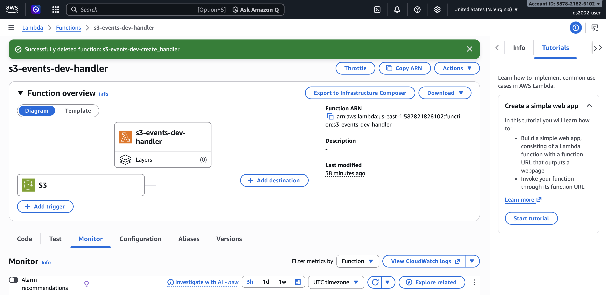

# Automation of Data Pipelines

The goal of this activity is to familiarize you with building and managing data pipelines. Data pipelines are essential for automating data workflows, processing data at scale, and creating reliable systems for transforming and moving data between systems.

> **Note:** Work through the examples below in your terminal (Codespace or local), experimenting with each command and its various options. If you encounter an error message, don't be discouraged—errors are learning opportunities. Reach out to your peers or instructor for help when needed, and help each other when you can. 

The in-class exercises will be introduced as instructor-led demos. Experiment with the code examples and explore the sections below on your own when you are ready. They may provide inspiration for the final projects.

## In-class exercises

### Cron Jobs

**Cron jobs** are commands or scripts that run **on a schedule** on Linux and similar systems (for example every minute while testing, or every day at 2:00). A background service, **`cron`**, reads your **crontab**—a small table of “when” and “what to run”—and starts each line at the right time. Cron is not an interactive login: it does not `cd` into your repo or load your usual shell config, so you normally give the **full path** to the script in the crontab line.

How scheduling works (big picture):

1. You write a **script** (here: [`01-simple-cron.sh`](./01-simple-cron.sh)) that does something when it runs.
2. Make your script executable with `chmod +x`.
3. Note the **absolute path** of your script.
4. Open your **crontab** with `crontab -e` and add one line: the **five time fields** (minute through day-of-week), then that full path to your script.
5. A background service **`cron`** wakes up and runs your script at the times you specified.
6. Cron is **not** your interactive terminal: it does not `cd` into your project folder and does not load your usual `.bashrc`. That is why the crontab line must use the **full path** to the script (e.g. `/home/mst3k/ds2002-course/practice/12-automation/01-simple-cron.sh`).

#### The five time fields

A crontab line starts with **five fields** (minute, hour, day-of-month, month, day-of-week), then the **command** to run.

```text
* * * * *  command goes here
│ │ │ │ │
│ │ │ │ └── day of week (0–7, Sunday = 0 or 7)
│ │ │ └──── month (1–12)
│ │ └────── day of month (1–31)
│ └──────── hour (0–23)
└────────── minute (0–59)
```

`*` means “every” for that column. So **` * * * * * `** means **every minute** (useful for a short test; change it later so you are not running jobs forever).

Examples:

| What you want | First five fields |
|----------------|-------------------|
| Every minute (testing only) | `* * * * *` |
| Every day at 2:30 AM | `30 2 * * *` |
| Every Monday at 9:00 AM | `0 9 * * 1` |

Full reference: `man crontab` and `man 5 crontab` on Linux, or search for “crontab guru” online for a helper.

#### `01-simple-cron.sh`

[`01-simple-cron.sh`](./01-simple-cron.sh) appends **one line** (timestamp + process ID) to **`~/cron-demo/runs.log`** each time it runs. After you schedule it, you can open that file and see new lines appear when cron fires.

#### Step A — Install and test the script

1. **Full path:** In a terminal, `cd` to this folder and print the absolute path:

   ```bash
   cd /path/to/ds2002-course/practice/12-automation
   pwd
   ```

   Copy that path; you will paste it into crontab.

2. **Executable:**

   ```bash
   chmod +x "01-simple-cron.sh"
   ```

3. **Run once by hand** (proves the script works):

   ```bash
   ./01-simple-cron.sh
   cat ~/cron-demo/runs.log
   ```

   You should see at least one line.

#### Step B — Schedule it with `crontab`

1. Open **your** crontab in an editor:

   ```bash
   crontab -e
   ```

   (First time, it may ask which editor to use; `nano` is fine.)

2. Add **one new line** at the bottom. Replace `/FULL/PATH/TO` with the real path from Step A (no spaces before the first `*`):

   ```text
   * * * * * /FULL/PATH/TO/ds2002-course/practice/12-automation/01-simple-cron.sh
   ```

   Save and exit the editor.

3. **Confirm** the line was saved:

   ```bash
   crontab -l
   ```

4. **Wait one or two minutes**, then check the log:

   ```bash
   cat ~/cron-demo/runs.log
   ```

   You should see **additional** lines (one per minute while the `* * * * *` line is present).

5. **When you are done testing**, remove or comment out the line (`crontab -e` again). Otherwise the script keeps running every minute.

#### Optional: capture cron’s own messages

The script already writes to `~/cron-demo/runs.log`. If you also want a file that captures anything the script prints to **stdout/stderr** (and cron warnings), you can use:

```text
* * * * * /FULL/PATH/TO/01-simple-cron.sh >> "$HOME/cron-demo-cron.log" 2>&1
```

---

### Python pipelines with Prefect

[Prefect](https://www.prefect.io/) is a Python library for **orchestrating** data workflows: you define small units of work as **tasks**, wire them together in a **flow**, and optionally **schedule** or **observe** runs. The three scripts below share the same *shape* of pipeline; [`02-etl.py`](./02-etl.py) is plain Python, while [`03-etl-prefect.py`](./03-etl-prefect.py) and [`04-etl-prefect-scheduled.py`](./04-etl-prefect-scheduled.py) express it with Prefect.

#### What the example pipeline does

In all three files, the logic is:

1. Draw **two** random integers, **add** them (the add step takes a **list** of two numbers and uses Python’s built-in `sum`).
2. Draw a **third** random integer.
3. **Divide** *(sum of the first two) ÷ (third number)* and print a line starting with `Result:`.

In [`02-etl.py`](./02-etl.py), [`03-etl-prefect.py`](./03-etl-prefect.py), and [`04-etl-prefect-scheduled.py`](./04-etl-prefect-scheduled.py), the first two draws use **`get_number()`** with default range **0–10**, and the third uses **`get_number(min_value=1, max_value=3)`** so the division step stays a small demo without huge quotients.

#### Setup

Install Prefect in the environment where you run the demos (your laptop, VM, or Codespace):

```bash
python3 -m pip install prefect
```

Then from this folder:

```bash
python3 02-etl.py
python3 03-etl-prefect.py
python3 04-etl-prefect-scheduled.py
```

**Optional:** Register for a free Prefect Cloud account and set up a Prefect API key.

- Sign up for a free account: [Prefect pricing (Start plan)](https://www.prefect.io/pricing?plan=start)
- Sign in to your Prefect account and create an API key. In Prefect Cloud go to `Home` > `Settings` > `API Keys`. Create and copy the API key (it starts with `pnu_`).
- In your terminal (local, AWS EC2 instance, UVA HPC system, etc.) run `prefect cloud login -k pnu_your_api_key_here`

#### [`02-etl.py`](./02-etl.py) — plain Python baseline

Let's start with a simple Python script that performs a few mathematical operations on three random numbers.



- **`get_number()`** — returns a random integer.
- **`add(numbers)`** — returns `sum(numbers)` for a list of two ints.
- **`divide(n1, n2)`** — returns `n1 / n2`.
- **`main()`** — calls those functions in order: two numbers, add, third number, divide, print.

Example output:
```
Getting number: 1
Getting number: 5
Adding [1, 5]
Getting number: 2
Dividing 6 by 2
Result: 3.0
```

> **Note:** The order of execution is strictly defined by the sequence of function calls in the `main()` function.

#### [`03-etl-prefect.py`](./03-etl-prefect.py) — tasks, flows, and `.submit()`

Just with a few small tweaks we can convert the Python script into a Prefect workflow:

- **`@task`** wraps `get_number`, `add`, and `divide` so Prefect can track each call as its own unit of work.
- **`@flow(name="Numbers Workflow", log_prints=True)`** wraps `main()` as a single pipeline aka a **flow run**. The `log_prints=True` sends `print` output into Prefect’s logging system.
- **`.submit()`** — inside `main()`, the calls to `get_number`, `add`, and `divide` are changed to use the `.submit()` method (provided by the `@task` decorators). For example, `number1 = get_number()` becomes `number1 = get_number.submit()`. That lets Prefect run those tasks with its own scheduling (a stepping-stone toward parallel execution).
- **`.result()`** — turns a **future** from `.submit()` into the task’s real return value. [`03-etl-prefect.py`](./03-etl-prefect.py) only needs this on the last step: `divide.submit(sum, number3).result()`, so `print` logs an actual number.

The **task implementations** (`get_number`, `add`, `divide`) match the plain-Python script; only **`main()`** changes to use Prefect’s `.submit()` / `.result()` pattern.

Run it:

```bash
python3 03-etl-prefect.py
```

Example output (your flow and task run IDs will differ):

```text
23:05:12.773 | INFO    | Flow run 'icy-raven' - Beginning flow run 'icy-raven' for flow 'Numbers Workflow'
23:05:12.776 | INFO    | Flow run 'icy-raven' - View at https://app.prefect.cloud/…
23:05:12.791 | INFO    | Task run 'get_number-924' - Getting number: 10
23:05:12.791 | INFO    | Task run 'get_number-fcb' - Getting number: 6
23:05:12.794 | INFO    | Task run 'get_number-9ba' - Getting number: 3
23:05:12.795 | INFO    | Task run 'get_number-fcb' - Finished in state Completed()
23:05:12.795 | INFO    | Task run 'get_number-924' - Finished in state Completed()
23:05:12.796 | INFO    | Task run 'get_number-9ba' - Finished in state Completed()
23:05:12.803 | INFO    | Task run 'add-726' - Adding [6, 10]
23:05:12.804 | INFO    | Task run 'add-726' - Finished in state Completed()
23:05:13.053 | INFO    | Task run 'divide-4bd' - Dividing 16 by 3
23:05:13.054 | INFO    | Task run 'divide-4bd' - Finished in state Completed()
23:05:13.055 | INFO    | Flow run 'icy-raven' - Result: 5.333333333333333
23:05:13.788 | INFO    | Flow run 'icy-raven' - Finished in state Completed()
```

If you **omit** `.result()` on the last `.submit()`, the value passed to `print` may be a **future object** instead of a number. For learning, focus on **task boundaries** and logs in the Prefect UI (below) if you use a server or Cloud workspace.

#### [`04-etl-prefect-scheduled.py`](./04-etl-prefect-scheduled.py) — same flow, served on a schedule

The **flow definition** (`@task` / `@flow` / `main()`) matches [`03-etl-prefect.py`](./03-etl-prefect.py). The module already imports `Interval`, `datetime`, and `timedelta` at the top. Under `if __name__ == "__main__":`, it calls **`main.serve(...)`** instead of **`main()`**:

```python
if __name__ == "__main__":
    main.serve(
        name="Numbers Workflow - Scheduled",
        schedule=Interval(
            timedelta(minutes=1),
            anchor_date=datetime(2026, 4, 4, 0, 0),
            timezone="America/New_York",
        ),
    )
```

- **`main.serve(...)`** — registers this flow as a **deployment** and starts a **long-running process** that will execute `main` according to the given schedule (similar in spirit to cron, but driven by Prefect’s scheduler).
- **`schedule=Interval(timedelta(minutes=1), anchor_date=..., timezone="America/New_York")`** — runs about **once per minute** from the anchor onward; change the interval, anchor, or timezone for your own demo.
- **`name="Numbers Workflow - Scheduled"`** — deployment label in the Prefect UI.

Start it:

```bash
python3 04-etl-prefect-scheduled.py
```

Leave the process running while you inspect runs. **Stop** it with `Ctrl+C` when you are done so you do not leave a tight loop running on shared machines.

#### Prefect UI (local or Cloud)

Prefect can show a **run history**, task timeline, and logs in a browser:

- **Local:** run `prefect server start` (see [Prefect server docs](https://docs.prefect.io/)) and open the URL it prints; configure your environment/workspace per current Prefect 2.x/3.x docs.
- **Prefect Cloud:** sign up at [prefect.io](https://www.prefect.io/) and connect your workspace so deployments and `serve` runs appear in the hosted UI.



#### Prefect Integrations

Prefect ships **blocks** and **integrations** (S3, Snowflake, Slack, etc.) so flows can talk to external systems with less boilerplate. This demo stays minimal on purpose; for S3 and other connectors, start from the [Integrations](https://docs.prefect.io/integrations/) section of the Prefect documentation.

### Event-triggered Pipelines with AWS Chalice

**AWS Chalice** is AWS’s **Python** framework for **serverless** apps: you write ordinary Python (routes, handlers, scheduled or event-driven functions), and Chalice packages the code, configures **AWS Lambda**, **API Gateway**, and related IAM wiring, and deploys it with a small CLI. It is a good fit when you want **HTTP-triggered** or **AWS-native event** automation instead of a long-lived server or only cron on a VM.

#### Setup

Install Chalice into your course Python environment (venv, Conda `ds2002`, Codespace, etc.):

```bash
python3 -m pip install chalice
```

Chalice relies on the **same AWS credentials and default region** as the AWS CLI (`~/.aws/credentials` and `~/.aws/config`). If you have not done this yet, follow the **`aws configure`** walkthroughs used elsewhere in the course:

- **[Lab 08: S3 — Setup](../../labs/08-s3/README.md#setup)** — environment, `aws configure`, and optional `boto3`
- **[Practice 09: IAM and S3 — AWS CLI configuration](../09-iam-s3/README.md#aws-cli-configuration)** — prompts for access key, secret, region, output format, and checks such as `aws sts get-caller-identity`
- **[Practice 10: Cloud](../10-cloud/README.md)** — also points at Lab 08 for installing and configuring the `aws` CLI

Confirm the CLI can reach your account before you deploy with Chalice:

```bash
aws sts get-caller-identity
```

#### S3 event trigger

This walkthrough creates a tiny Chalice app whose Lambda runs whenever **new objects are created** in an **existing** S3 bucket. Chalice wires the bucket’s event notification to your function when you **`chalice deploy`** (this path does **not** support `chalice package`; see [Chalice S3 events](https://aws.github.io/chalice/topics/events.html#s3-events)).

**Step 1.** Use a real bucket in your default region.

Create a bucket (console or `aws s3 mb`) or reuse one from [Lab 08](../../labs/08-s3/README.md). The bucket name must match what you set in `app.py` in Step 3, and your [configured region](../../labs/08-s3/README.md#setup) should match the bucket’s region.

**Step 2.** Scaffold a project (from a parent directory where you want the new folder):

```bash
chalice new-project s3-events
cd s3-events
```

**Step 3.** Edit `app.py` — keep or remove the sample `@app.route('/')` handler; add or adjust an S3 handler that **logs** the bucket and object key (visible in CloudWatch and via `chalice logs`). Set `bucket=` to your bucket name; `events` limits notifications to new objects. (The sample under [`s3-events/app.py`](./s3-events/app.py) in this repo uses **`chalice-example`** until you change it.)

```python
from chalice import Chalice

app = Chalice(app_name="s3-event")

@app.on_s3_event(
    bucket="REPLACE_WITH_YOUR_BUCKET_NAME",
    events=["s3:ObjectCreated:*"],
)
def handler(event):
    app.log.info("S3 object created: bucket=%s key=%s", event.bucket, event.key)
```

**Step 4.** Deploy (requires IAM permissions to create or update Lambda, roles, and S3 notifications):

```bash
chalice deploy
```

**Step 5.** Generate an event — upload a test object (bucket name must match **`bucket=`** in `app.py`, e.g. `chalice-example` if you kept the sample bucket):

```bash
echo "hello" > hello.txt
aws s3 cp hello.txt s3://YOUR_BUCKET_NAME/
```

**Step 6.** Confirm logs — after a short delay, from the **`s3-events`** project directory:

```bash
chalice logs -n handler
```

The **`-n`** flag is the name of the Python function in `app.py` (here, `handler`). You should see a line containing your bucket name and object key. When you are done experimenting, run **`chalice delete`** to tear down the app and remove the deployed resources.

You can also inspect the Lambda function and log streams in the AWS Management Console.



**Step 7. (Optional)** Change the S3 event handler to implement new behavior, for example transforming an object and copying it to another bucket.

### Scheduled Lambda functions with AWS Chalice

Besides **S3 notifications**, Chalice can attach your code to **time-based schedules** managed by **Amazon EventBridge** (CloudWatch Events). When you deploy, Chalice creates a separate Lambda and rule so your function runs on a **cron** (or **rate**) expression—similar in spirit to Linux `cron`, but the job runs in AWS with no server you SSH into.

The snippet below registers a **scheduled** handler. The string inside `cron(...)` follows **EventBridge’s six-field** form: `minutes hours day-of-month month day-of-week year`. Here, `0 8` is 08:00, `?` means “any” for day-of-month (required when day-of-week is set), `*` is every month, `MON-FRI` restricts runs to weekdays, and the final `*` is every year. **Times are in UTC** unless you configure otherwise in AWS.

When the schedule fires, Chalice invokes `daily_at_eight` with an **event** object (metadata about the scheduled run). You can replace the `print` with real work: call other AWS APIs, run ETL, send notifications, and so on. After editing `app.py`, run **`chalice deploy`** again so the schedule and Lambda stay in sync. See also [Chalice scheduled events](https://aws.github.io/chalice/topics/events.html#scheduled-events).

If you already have an `app` from the S3 walkthrough, **do not** create a second `Chalice(...)` instance—add only the `@app.schedule` function to the same `app.py`.

```python
from chalice import Chalice

app = Chalice(app_name="scheduled-demo")

@app.schedule("cron(0 8 ? * MON-FRI *)")
def daily_at_eight(event):
    print("Executing on a set schedule")
```

## Resources

- [Getting started with Cron jobs](https://www.linux.com/training-tutorials/scheduling-magic-intro-cron-linux/)
- [Prefect documentation](https://docs.prefect.io/)
- [Prefect Cloud sign-up](https://www.prefect.io/pricing?plan=start)
- [Prefect integrations](https://docs.prefect.io/integrations/)
- [AWS Chalice — quickstart and tutorials](https://aws.github.io/chalice/)
- [AWS Chalice workshop](https://chalice-workshop.readthedocs.io/en/latest/index.html)
