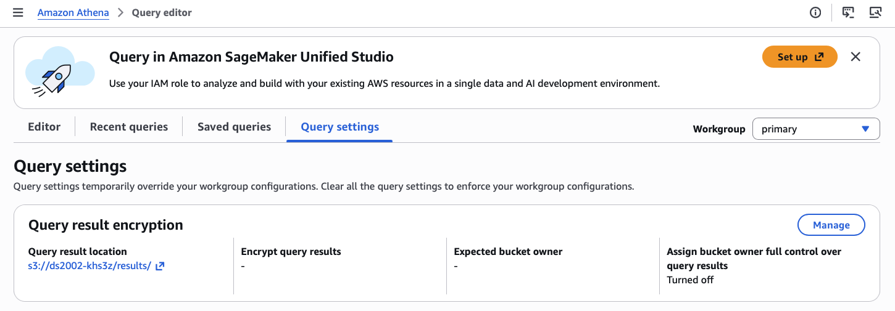
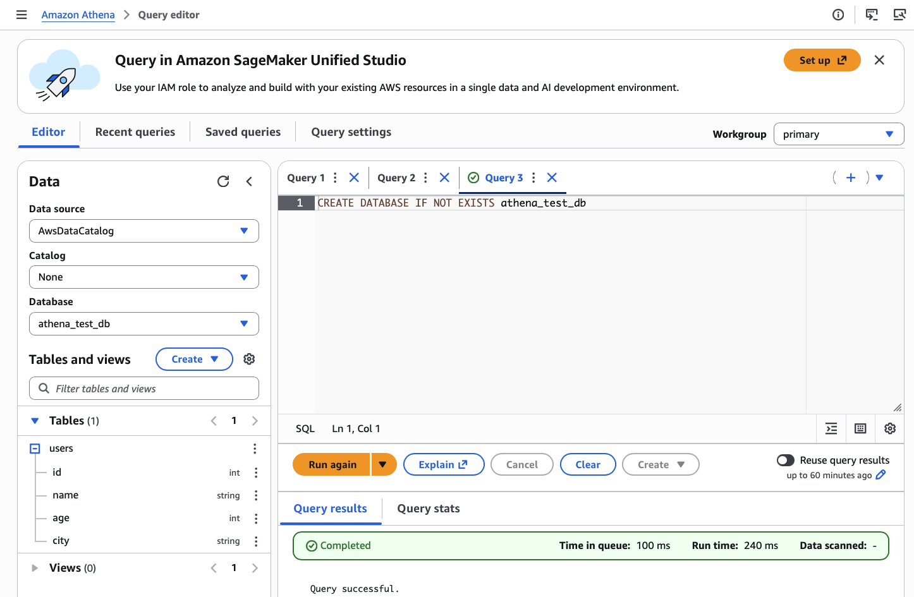
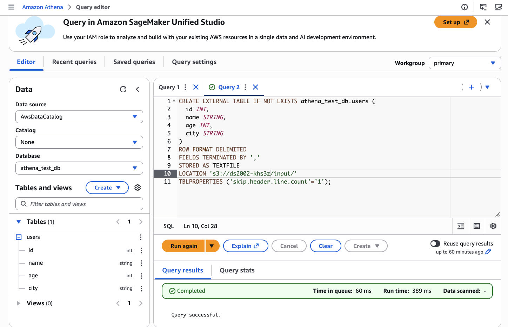
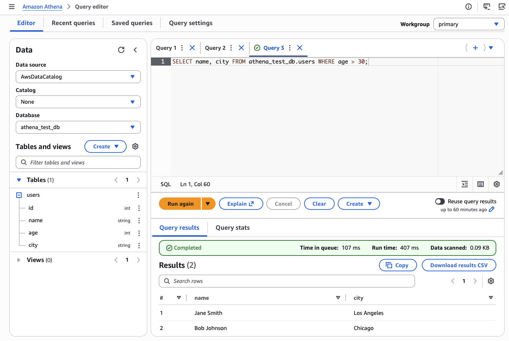

# AWS Athena

**Amazon Athena** is a **serverless** interactive query service: you run **SQL** in the **AWS Management Console** or via an API, and Athena runs the query against **data stored in Amazon S3** using the **AWS Glue Data Catalog** as the metadata layer. You do not provision or manage query servers; you pay primarily for the volume of data scanned.

Typical use cases:

- **Ad hoc analysis** on files already in S3 (CSV, JSON, Parquet, ORC, Avro, and more).
- **Data lake** exploration: partition large datasets and query subsets to limit scan cost.
- **Log and event analysis** (for example, CloudFront, ALB, or application logs landed in S3).
- **Lightweight reporting** or checks before loading curated data into a warehouse or downstream jobs.
- **Prototyping** SQL over raw or semi-structured data before committing to a heavier ETL pipeline.

## Setup

You need:

- An **AWS account** and credentials with permission to use **Athena**, **S3** (read data objects, write query results), and **AWS Glue** (create or use a database in the Data Catalog). 
- The **AWS CLI** configured for the same account and default **Region** where your S3 data and Athena workgroup live. If you have not configured the CLI yet, follow the course setup guides—for example, [Create an AWS IAM user](../../setup/aws-iam-user.md) and the `aws configure` steps in [Lab 08: S3](../../labs/08-s3/README.md#setup) or [Practice 09: IAM and S3](../09-iam-s3/README.md#aws-cli-configuration).
- **Python** with **boto3** if you run Athena from scripts later; for this walkthrough, the **Athena query editor** in the console is enough.

After setting up your Access Keys, confirm the AWS CLI can reach your account:

```bash
aws sts get-caller-identity
```

## Example: Query CSV data in S3

This example puts a small **CSV** under a prefix in S3, registers an **external table** in Athena pointing at that prefix, and runs a few **SELECT** statements.

### 1. Create sample data and upload to S3

Athena works best when each prefix behaves like a **single table**: same column layout (and usually the same format) for every object in that folder.

Create a file named `users.csv` on your machine:

```csv
id,name,age,city
1,John Doe,28,New York
2,Jane Smith,34,Los Angeles
3,Bob Johnson,45,Chicago
```

In the **S3** console (or with `aws s3 cp`):

1. Create a bucket with a **globally unique** name (replace the placeholder below).
2. Create a folder (prefix) such as `input/`.
3. Upload `users.csv` into `input/`.

Example CLI upload (replace `YOUR_BUCKET`):

```bash
aws s3 cp users.csv s3://YOUR_BUCKET/input/users.csv
```

**Note:** Point the table **LOCATION** at the **folder** (`.../input/`), not the single file name, so you can add more CSV files with the same schema later if you want.

### 2. Set the Athena query result location

Every Athena query writes result objects to S3. Configure that location once per workgroup (or rely on the default workgroup settings your account already uses).

1. In S3, create a prefix for results, for example `s3://YOUR_BUCKET/results/`. We can simulate an empty `results` folder by creating a zero-byte object with a key that ends in a forward slash, e.g. `aws s3api put-object --bucket YOUR_BUCKET --key results/`.
2. Open the **Athena** console → **Settings** (gear) or **Workgroups** → choose your workgroup (often **primary**) → **Edit** → set **Query result location** to `s3://YOUR_BUCKET/results/` (must be a valid S3 URI with a trailing slash) → save.



### 3. Create a database and external table

Open the **Athena** query editor. Ensure the **Data source** is **AwsDataCatalog** and choose a **Workgroup** that has the result location set in step 2.

**Step A — create a database**

```sql
CREATE DATABASE IF NOT EXISTS athena_test_db;
```



Run the statement. If the console prompts you to finish one-time setup for the Data Catalog or default paths, follow the on-screen instructions.

**Step B — create an external table**

Replace `YOUR_BUCKET` with your bucket name. The `LOCATION` must be the S3 **prefix** that contains `users.csv` (here `input/`).

```sql
CREATE EXTERNAL TABLE IF NOT EXISTS athena_test_db.users (
  id INT,
  name STRING,
  age INT,
  city STRING
)
ROW FORMAT DELIMITED
FIELDS TERMINATED BY ','
STORED AS TEXTFILE
LOCATION 's3://YOUR_BUCKET/input/'
TBLPROPERTIES ('skip.header.line.count'='1');
```



Replace `YOUR_BUCKET` with your bucket name. Run the statement. 

### 4. Run queries

```sql
SELECT * FROM athena_test_db.users LIMIT 10;
```

```sql
SELECT name, city FROM athena_test_db.users WHERE age > 30;
```



Inspect **Query results** in the console and the new objects under your `results/` prefix in S3.

## Advanced Concepts (Optional)

- **Partitions:** add `PARTITIONED BY (...)` and `MSCK REPAIR TABLE` or `ALTER TABLE ADD PARTITION` so queries scan less data.
- **Columnar formats:** store data as **Parquet** or **ORC** to reduce bytes scanned and cost versus raw CSV.
- **Workgroups:** separate teams or workloads with different result locations, limits, or metrics.

## Resources

### Athena

- [What is Amazon Athena?](https://docs.aws.amazon.com/athena/latest/ug/what-is.html)
- [Getting started with Amazon Athena](https://docs.aws.amazon.com/athena/latest/ug/getting-started.html)
- [Running SQL queries using Amazon Athena](https://docs.aws.amazon.com/athena/latest/ug/querying-athena-tables.html)
- [SQL reference for Amazon Athena](https://docs.aws.amazon.com/athena/latest/ug/ddl-sql-reference.html)
- [CREATE TABLE](https://docs.aws.amazon.com/athena/latest/ug/create-table.html) (formats, SerDe, and `TBLPROPERTIES` such as skipping a header row)
- [Partitioning data in Athena](https://docs.aws.amazon.com/athena/latest/ug/partitions.html)
- [Using workgroups to control query access and costs](https://docs.aws.amazon.com/athena/latest/ug/workgroups.html)
- [Specifying a query result location](https://docs.aws.amazon.com/athena/latest/ug/querying.html#query-results-specify-location-console)
- [Amazon Athena pricing](https://aws.amazon.com/athena/pricing/)

### AWS Glue Data Catalog (with Athena)

- [AWS Glue Data Catalog and Amazon Athena](https://docs.aws.amazon.com/athena/latest/ug/data-sources-glue.html)
- [What is AWS Glue?](https://docs.aws.amazon.com/glue/latest/dg/what-is-glue.html)

### Automation and CLI

- [AWS CLI Command Reference: `athena`](https://docs.aws.amazon.com/cli/latest/reference/athena/index.html)
- [Boto3: Amazon Athena client](https://boto3.amazonaws.com/v1/documentation/api/latest/reference/services/athena.html)