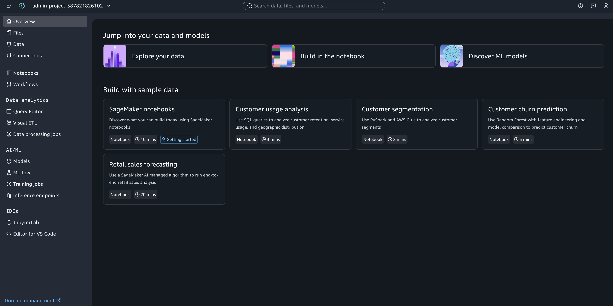
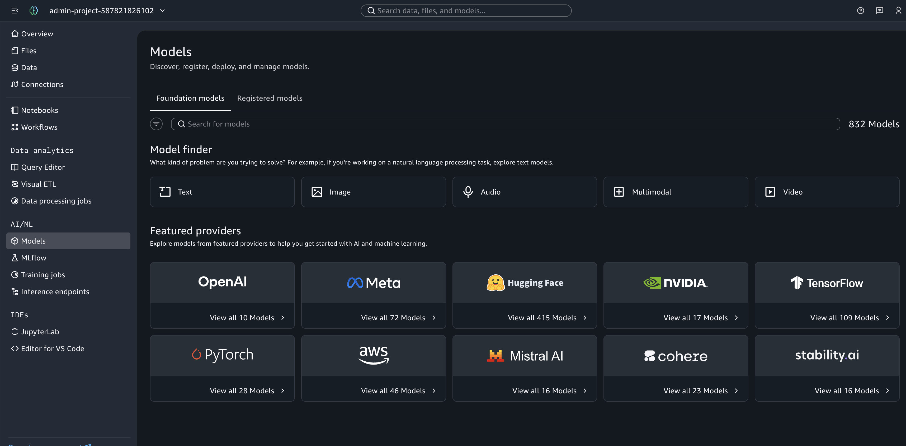
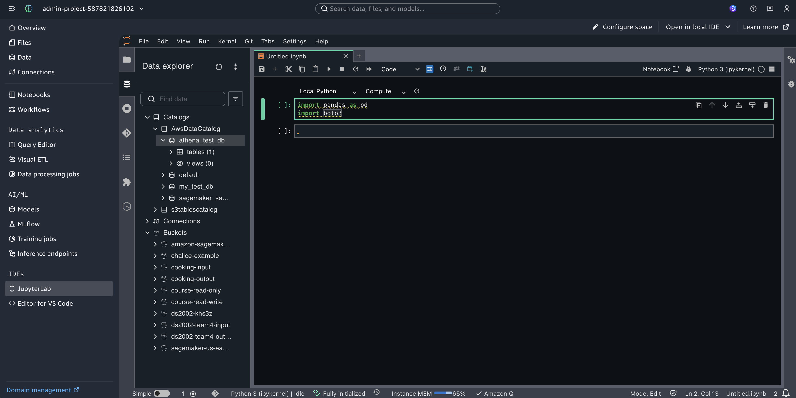
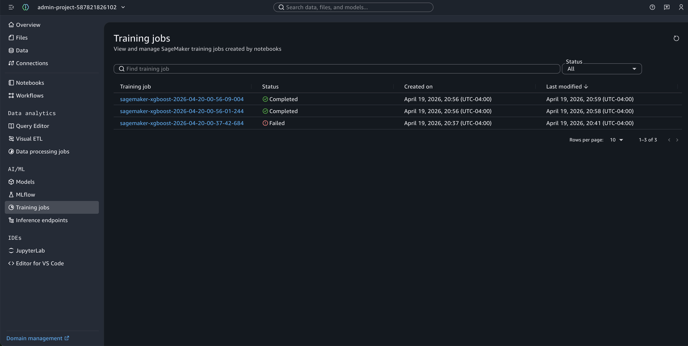

# Amazon SageMaker

**Amazon SageMaker** is a managed service for the machine learning lifecycle:
- Prepare data in **Amazon S3**.
- Train models on managed compute (with many built-in algorithms and frameworks).
- Tune hyperparameters.
- Deploy models to real-time or batch endpoints.
- Monitor behavior in production.

You pay for the compute and storage you use (for example, training instance hours and endpoint uptime).

Typical use cases:

- **Training** classical ML models (XGBoost, Linear Learner, etc.) or deep learning (TensorFlow, PyTorch, Hugging Face) without running your own cluster.
- **Managed notebooks** (Studio or notebook instances) for experimentation with the **SageMaker Python SDK** and tight integration with S3 and IAM.
- **MLOps-style pipelines** (Pipelines, Model Registry, Projects) for repeatable workflows.
- **Prebuilt solutions** and **JumpStart** to deploy foundation models or common architectures with less boilerplate.
- **Batch transform** or **real-time inference** once a model artifact exists in S3.

## Setup

You need:

- An **AWS account** and an **IAM role** that SageMaker can assume to run training and access your S3 buckets (and, depending on your workflow, **ECR**, **CloudWatch Logs**, and **VPC** resources). The console can create an **Amazon SageMaker execution role** for you, or your instructor may supply a role ARN.
- **Amazon S3** for **input data** and **model output**. In this example, `launch.py` uses the same bucket for both: it reads `SAGEMAKER_DEFAULT_BUCKET` if set, otherwise `Session.default_bucket()`. Upload `train.csv` to `sagemaker/xgboost/train/` in that bucket (see the `aws s3 cp` command below).
- The **AWS CLI** configured for the same account and **Region** where you will run SageMaker. If you have not configured the CLI yet, follow the course setup guides—for example, [Create an AWS IAM user](../../setup/aws-iam-user.md) and the `aws configure` steps in [Lab 08: S3](../../labs/08-s3/README.md#setup) or [Practice 09: IAM and S3](../09-iam-s3/README.md#aws-cli-configuration).
- **Python 3** with the **SageMaker Python SDK v2** in the same environment you use to run `launch.py`. From this folder run `pip install -U -r requirements.txt`, which pins `sagemaker>=2.75.0,<3` (SDK **v3** uses different modules and APIs). Check with `python -c "import sagemaker; print(sagemaker.__version__)"` — it should start with `2.`. If you already installed `sagemaker` 3.x, run `pip install 'sagemaker>=2.199,<3'` in that environment. Do **not** add a file named `sagemaker.py` here—it shadows the real package.

**Imports:** Use `from sagemaker.image_uris import retrieve` (the submodule). Do **not** use `from sagemaker import image_uris` — `image_uris` is often **not** re-exported on the top-level `sagemaker` package, which causes `ImportError: cannot import name 'image_uris'`. See the [Image URIs](https://sagemaker.readthedocs.io/en/v2.232.0/api/utility/image_uris.html) page in the **SageMaker Python SDK v2** documentation (Read the Docs `stable` currently targets **v3**, so v2 links use a fixed **v2.232.0** path).

After setting up your access keys, confirm the CLI can reach your account:

```bash
aws sts get-caller-identity
```

**Cost:** Training jobs and notebook instances incur charges. Use a small instance type for prototyping, delete **endpoints** when finished, and stop **notebook instances** or shut down **Studio** apps when you are done.

If you use **SageMaker Studio**, the overview below maps the left navigation to training jobs, data prep, and the IDE. If you run the SDK only from your laptop, skip ahead to the **Example** section.

## SageMaker Studio

**Amazon SageMaker Studio** is the web-based workspace for SageMaker. After you open Studio for your **user profile** in a **domain**, the **left navigation bar** (vertical rail) lists top-level areas. Choosing one opens subnavigation with specific apps and resources. Icons and labels vary by **Studio version** and what your administrator enabled.



### Data analytics

This area groups **data exploration and preparation**, for example launching **Amazon Athena** queries, working with **Amazon EMR** or Spark, or using **visual data prep** tools. Use it when your pipeline starts in **S3**, a **data lake**, or a **data warehouse** and you need SQL or large-scale prep **before** you train in SageMaker.

### AI / ML

This area is the **SageMaker operations** hub: **training jobs**, **hyperparameter tuning**, **experiments**, **models**, **endpoints**, **pipelines**, and related workflows. Training jobs you start with `launch.py` (or any SDK call, see example below) show up here for the **same AWS account and Region**; they are not “local only.” You can also open **Training jobs** under **SageMaker** in the classic AWS console.



### IDE

This area hosts **interactive development**: **JupyterLab**, a **VS Code–style code editor**, and **terminals**. Use it to run notebooks, call `sagemaker.get_execution_role()`, and edit `container_source/train.py` before you submit a job.

**Tip:** Match the **Region** in the Studio top bar to the Region you used when launching training. If your domain still shows the **older Studio UI**, use the console path **SageMaker → Training → Training jobs** instead.



## Example: Train an XGBoost model on CSV in S3

This walkthrough uploads a small `train.csv`, then starts a **SageMaker training job** using the **managed XGBoost container** in **script mode**. The training script is `container_source/train.py` (kept in its own folder on purpose—see the note below about `requirements.txt`).

### 1. Prepare data and upload to S3

This repository includes `train.csv` (a tiny toy dataset with columns `f1`–`f4` and `target`). Copy or download it, then upload it to a prefix in your bucket (replace `YOUR_BUCKET` and your AWS Region):

```bash
aws s3 cp train.csv s3://YOUR_BUCKET/sagemaker/xgboost/train/train.csv
```

The training script expects a file named `train.csv` in the channel directory (see `container_source/train.py`).

### 2. Execution role

SageMaker needs an IAM **role ARN** whose trust policy allows `sagemaker.amazonaws.com` to assume it, with permissions to read your input objects in S3, write model artifacts to S3, write logs to CloudWatch, and pull the training image from ECR.

- If you run the Python code **inside** SageMaker Studio or a **notebook instance**, you can use:

  ```python
  import sagemaker

  sess = sagemaker.Session()
  role = sagemaker.get_execution_role()
  ```

- If you run **on your laptop** or **Open OnDemand**, use a role ARN your administrator created, or set `SAGEMAKER_ROLE_ARN` before running `launch.py`. The ARN looks like:

  ```text
  arn:aws:iam::YOUR_ACCOUNT_ID:role/YOUR_ROLE_NAME
  ```

### 3. Launch a training job from Python

To submit any SageMaker **training job** (including this example), you need the same core ingredients:

- **Execution role** — An IAM role ARN that SageMaker can assume (`sagemaker.amazonaws.com` in the trust policy). It must allow the operations you need: read training data from S3, write model artifacts and logs, pull the algorithm image from ECR, and emit CloudWatch metrics.
- **Algorithm image** — The Docker image that runs your training code. Here we resolve the official **XGBoost** training image for your Region with `image_uris.retrieve(...)`.
- **Training code** — `entry_point` (for example `train.py`) plus `source_dir` (only the files the container should see; no stray `requirements.txt` unless you intend pip installs in the container).
- **Input channels** — S3 URIs (or file mode) passed to `fit()`, for example `{"train": "s3://bucket/prefix/"}`. The container reads them from paths like `SM_CHANNEL_TRAIN`.
- **Output location** — The S3 prefix where `model.tar.gz` and related outputs are written (the `output_path` argument on the estimator).
- **Compute** — `instance_type` and `instance_count` for the managed training fleet.
- **Optional hyperparameters** — Passed through to your script as CLI flags (here: tree depth, learning rate, rounds, and objective settings).
- **API caller** — Your laptop or Studio runs the Python SDK with valid AWS credentials in the **same Region** as the bucket and image.

#### What are we training?

The example uses `train.csv`, a **tiny toy dataset** (only a handful of rows) with **four numeric inputs** (`f1`–`f4`) and a **multiclass label** `target` with values **0, 1, and 2**—the same shape as the classic **Iris** problem (three species), but small enough to run quickly and cheaply. It is **not** meant to be rigorous science; it exists so you can verify end-to-end that **S3 → training job →** `model.tar.gz` works.

The **modeling approach** is **XGBoost** (gradient-boosted decision trees) in **script mode**: `container_source/train.py` reads the CSV from the `train` channel, builds an `xgboost.DMatrix`, and calls `xgboost.train` with objective `multi:softmax` and `num_class: 3`. Hyperparameters such as `max_depth`, `eta`, and `num_round` are passed from `launch.py` into the container as CLI flags. SageMaker’s **managed XGBoost image** supplies a compatible **pandas / numpy / xgboost** stack so you do not ship your own training Dockerfile for this walkthrough.

From the `practice/14-sagemaker` directory, run `python launch.py` after `pip install -U -r requirements.txt` on your machine (that file is only for your laptop—it is **not** uploaded as training code). `launch.py` resolves the execution role and bucket from the SageMaker session (Studio / notebook) or from optional environment variables `SAGEMAKER_ROLE_ARN` and `SAGEMAKER_DEFAULT_BUCKET` (see the script docstring).

Why `container_source/`? If `source_dir` includes a `requirements.txt`, SageMaker runs `pip install -r requirements.txt` inside the training container. Our launcher requirements pull in `sagemaker` and can **replace numpy** in the image, which then fails with errors like `ImportError: numpy.core.multiarray failed to import` when `import xgboost` runs. The training script therefore lives only under `container_source/`, which has **no** `requirements.txt`.

```python
import os

import sagemaker
from sagemaker.estimator import Estimator
from sagemaker.image_uris import retrieve

sess = sagemaker.Session()
region = sess.boto_session.region_name
instance_type = "ml.m5.large"
framework_version = "1.7-1"  # try "1.5-1" if this image is not in your Region

image_uri = retrieve(
    framework="xgboost",
    region=region,
    version=framework_version,
    py_version="py3",
    image_scope="training",
    instance_type=instance_type,
)

_env_role = (os.environ.get("SAGEMAKER_ROLE_ARN") or "").strip()
role = _env_role if _env_role else sagemaker.get_execution_role()
_env_bucket = (os.environ.get("SAGEMAKER_DEFAULT_BUCKET") or "").strip()
bucket = _env_bucket if _env_bucket else sess.default_bucket()
train_s3 = f"s3://{bucket}/sagemaker/xgboost/train/"
output_path = f"s3://{bucket}/sagemaker/xgboost/output/"

estimator = Estimator(
    image_uri=image_uri,
    entry_point="train.py",
    source_dir="container_source",  # only train.py — no requirements.txt here
    role=role,
    output_path=output_path,
    instance_count=1,
    instance_type=instance_type,
    sagemaker_session=sess,
    hyperparameters={
        "max_depth": 5,
        "eta": 0.2,
        "objective": "multi:softmax",
        "num_class": 3,
        "num_round": 20,
    },
)

estimator.fit({"train": train_s3})
```

The job uploads `container_source/train.py`, downloads `train.csv` from S3, runs training, and writes the **trained model** to S3 as a tarball (`model.tar.gz`). In `launch.py`, `output_path` uses the same bucket as the training data prefix (`s3://<bucket>/sagemaker/xgboost/output/`); SageMaker adds a **job-specific subfolder** under that prefix (see the exact URI in the console or in the script’s printed `estimator.model_data` after `fit()` completes).

### 4. Monitor and next steps

- After `fit()` returns, `launch.py` prints the **training job name** and the **model artifact S3 URI** (the `model.tar.gz` location). In the **SageMaker** console, open **Training** → **Training jobs** → your job → **Output** (or **Monitor**) to confirm the same S3 paths, **CloudWatch** logs, and metrics.
- To **deploy** a real-time endpoint or run **batch transform**, use the [SageMaker SDK deployment guides](https://docs.aws.amazon.com/sagemaker/latest/dg/deploy-model.html) (optional extension for this course).
- In **SageMaker Studio**, you can inspect job status and links to S3 under **Training jobs** (wording may vary by Studio version).



## Advanced Concepts (Optional)

- **SageMaker Studio** and **Pipelines** for repeatable, versioned ML workflows.
- **Automatic model tuning** (hyperparameter search) and the **Model Registry**.
- **Bring your own container** (BYOC) or **custom training images** when you outgrow built-in frameworks.
- **Feature Store** and **Data Wrangler** for feature engineering at scale.

## Resources

### SageMaker (overview and training)

- [What is Amazon SageMaker?](https://docs.aws.amazon.com/sagemaker/latest/dg/whatis.html)
- [Get started with Amazon SageMaker](https://docs.aws.amazon.com/sagemaker/latest/dg/getting-started.html)
- [Use XGBoost with the SageMaker Python SDK](https://docs.aws.amazon.com/sagemaker/latest/dg/xgboost.html)
- [Train a model with Amazon SageMaker](https://docs.aws.amazon.com/sagemaker/latest/dg/how-it-works-training.html)
- [SageMaker execution role](https://docs.aws.amazon.com/sagemaker/latest/dg/sagemaker-roles.html)
- [Amazon SageMaker pricing](https://aws.amazon.com/sagemaker/pricing/)

### Python SDK and automation

- [SageMaker Python SDK documentation (v2)](https://sagemaker.readthedocs.io/en/v2.232.0/) (Read the Docs `stable` currently shows **v3**; this course pins **v2**—see `requirements.txt`.)
- [AWS CLI Command Reference: `sagemaker`](https://docs.aws.amazon.com/cli/latest/reference/sagemaker/index.html)
- [Boto3: Amazon SageMaker client](https://boto3.amazonaws.com/v1/documentation/api/latest/reference/services/sagemaker.html)
