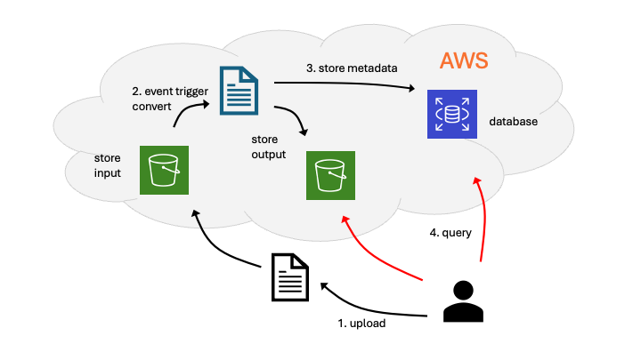

# Project A: File Converter

In earlier modules you worked with data formats, databases, cloud storage, and cloud compute. This project is where those pieces click into place: you will design and build an event-driven file processing pipeline on AWS that runs automatically whenever new files arrive.

Users upload files to a cloud storage location. When a file lands, AWS triggers your code. Your pipeline converts the file, writes the result to an output folder, and records what happened in a database. You choose the conversion (for example, CSV to Parquet, image resize, text normalization, TXT to PDF) and the exact formats. You will also make design decisions about which storage, compute, and database services to use for this project.

---

## How This Builds on the Course

| You've already seen… | You'll use it here for… |
|----------------------|-------------------------|
| Lab 04: Data formats (JSON, CSV, parsing, cleaning) | Defining input and output formats and implementing the conversion logic in your code. |
| Lab 05: SQL and NoSQL databases | Persisting a processing log: input key, output key, timestamp, status, and optional error details. |
| Lab 08: Cloud storage | Storing input and output files in designated bucket prefixes. |
| Lab 09: Cloud compute (Lambda and EC2) | Running your conversion code in the cloud. |

---

## Functional Requirements

1. **Receive input files**
   - Define at least one supported input format (for example, `.csv`, `.json`, `.txt`, images).
   - Files are uploaded to a cloud storage location that serves as your input folder.

2. **Event-driven computing**

   - Trigger processing when new files arrive in the cloud storage input folder.
   - Configure storage event notifications on your input storage.
   - The event invokes a function that:
     - Reads the new object from the input location.
     - Applies your chosen conversion or transformation.
     - Writes the processed file(s) to a cloud storage output folder.
   - Keep input and output folders separate.
   - Output file names should map clearly to the original input (for example, `input.csv` → `input.parquet`, or `input.csv` → `input_processed.json`).

3. **Store a processing record in a database**
   
   For every processed file, create a row or document with at least:
     - Input object key and bucket.
     - Output object key and bucket.
     - Timestamp of processing.
     - Status (for example, `SUCCESS` or `FAILED`) and an error message if relevant.
   
   Use any managed AWS database you prefer, such as Amazon DynamoDB (NoSQL) or Amazon RDS (PostgreSQL or MySQL).

4. **Query the database**

   Write a script that queries the database and checks whether a file in the input bucket has been processed. If so, return the location of the corresponding converted file in the output bucket. Pass the file (or prefix) to check as a command-line argument. If the argument is a prefix, the script should return all matching input locations and their corresponding output locations.

---

## Your Tasks

Complete:

- [Milestone 1](../milestone-1.md) — design plan  
- [Milestone 2](../milestone-2.md) — pipeline implementation and documentation  
- [Personal reflection](../reflection.md)

Review [Timeline and deliverables](../README.md#timeline-and-deliverables) for details.
