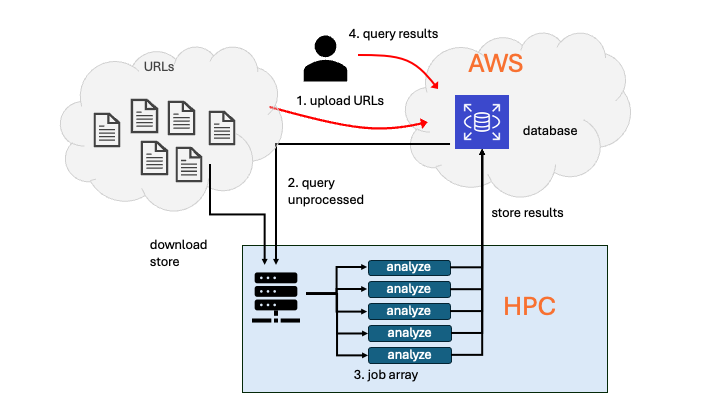

# Project B: HTC Text Analyzer

In Lab 07 you learned how to use the UVA HPC cluster and the Slurm scheduler to process multiple text files in parallel with a job array, using `process-book.py` as the core text analysis task. This project builds directly on that work. You will generalize the lab setup from a fixed set of local book files to an open-ended list of text URLs, integrate a cloud database, and automate the end-to-end text analysis pipeline.

Rather than manually managing a few input files, you will let a script generate a list of text URLs (for example, books from Project Gutenberg), automatically size a Slurm job array based on that list, and have each array task download, store, analyze, and record results for one text at a time.

---

## How This Builds on the Course

| You've already seen… | You'll use it here for… |
|----------------------|-------------------------|
| Lab 04: Data formats and ETL | Working with text and tabular outputs, and structuring an extract–transform–load style pipeline. |
| Lab 05 & 06: Databases | Defining tables/collections and inserting records so you can store processing metadata and results in a cloud database. |
| Lab 07: HPC and Slurm job arrays | Using Slurm batch scripts and job arrays to process many text files in parallel with `process-book.py`. |

---

## Functional Requirements

1. **Create an input file of text URLs**  
   Write a script that accepts a single command-line argument: a URL to a downloadable plain-text source (for example, Project Gutenberg, or an alternative you document). The script should also read environment variables that define the database URL, the table or collection name, and database user credentials. When the script runs, it should
   - Check first if the URL already exists in the database collection. If yes, do nothing. 
   - If not, the URL will be added to the specified database table/collection with the status "unprocessed". 

2. **Query unprocessed text URLs**  
   Write a second script that accepts a command-line argument specifying an output directory. The script must:
   - Query the database for a list of URLs (texts) that have not been processed yet.
   - Write that list to a text file, one URL per line (this file is the input for the next step).
   - Use the number of lines (URLs) in that file to size and submit a Slurm job array. Pass the output directory as an argument to the job script. **Hint:** you can set the array size from the shell, for example: `sbatch --array=1-n my-job-script`. That overrides an array range set inside the job script.

3. **Slurm job array**  
   ***Each array task*** must:
   - Check the database to determine whether the URL for its task has already been processed (sanity check because there could be a time lag between check in step 1 and Slurm array job execution).  
   - If the URL has not been processed yet:
     - Download the text from the URL.
     - Store the downloaded text in the designated output location (for example, a subdirectory under `/scratch/$USER/...`).
     - Process exactly one text file using the `process-book.py` script from Lab 07 (or a clearly documented variant of it).
     - Create a new database entry that records the text document (for example, URL and storage path) and the processing results (for example, path to the results file and summary statistics) in the database. Each record/document should contain at least: URL, storage location on HPC, processing status, and references to the results.  

4. **Database query**
   Write a script (Bash or Python) that lets users query the database to see whether a given text has already been analyzed. If so, return the analysis results.

The core analysis behavior from Lab 07 (tokenization, lemmatization, word counting) should remain recognizable, even if you adapt it for additional statistics or output formats.

---

## Your Tasks

Complete:

- [Milestone 1](../milestone-1.md) — design plan  
- [Milestone 2](../milestone-2.md) — pipeline implementation and documentation  
- [Personal reflection](../reflection.md)

Review [Timeline and deliverables](../README.md#timeline-and-deliverables) for details.