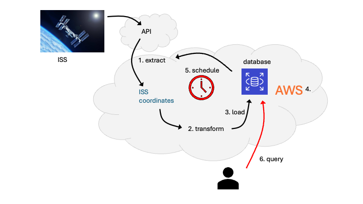

# Project C: Automatic ISS Tracker

In `Lab 04` you built an ETL pipeline that fetches the ISS position from a public API, transforms the JSON into a tabular format, and appends each reading to a CSV file. In `Lab 05` you went further: you converted those same ISS coordinates and fed them into a SQL database. This project builds directly on that work. 

**Your goals:**
- **deploy** the tracker on AWS so it runs in the cloud; 
- **automate** the pipeline with scheduling so it runs periodically and builds a long-running position history stored in a database;
- **query** the database to retrieve time-series data; 
- **optional: expose** the data via a simple API or dashboard so users can query positions by time or reporter without having to access the database directly. 
 
You’re not building the tracker from scratch—you’re turning your Lab 05 database-driven ISS system into a deployed, production-style AWS service.

---

## How This Builds on the Course

| You've already seen… | You'll use it here for… |
|----------------------|-------------------------|
| Lab 04: Data formats & ETL (API, JSON, pandas, CSV) | Extract and transform: fetch ISS position from `http://api.open-notify.org/iss-now.json`, parse JSON, convert UNIX timestamps to datetimes. Reuse or adapt this logic from your Lab 04 (and Lab 05) `iss.py`. |
| Lab 05: Database-driven ISS tracker (Case Study 2) | You already convert ISS coordinates and load them into the MySQL `iss` database (`locations` + `reporters`) from Python (schema plus parameterized INSERTs). This project extends that working Lab 05 system for AWS scheduling and deployment, and optionally adds query scripts or an API layer. |
| Lab 08 & Lab 09: AWS deployment | Deploy the tracker as an AWS service: for example, a Lambda function triggered on a schedule, or the ETL running on EC2 or in a container with cron or EventBridge. The database (for example, Amazon RDS) is already in AWS from Lab 05. |
| Scheduling and automation (required) | Run the pipeline on a schedule (for example, Amazon EventBridge or a scheduled Lambda invocation) so the database grows over time without manual runs. |
| Optional: API | Expose read-only endpoints (for example, API Gateway plus Lambda) or a small web app that queries the `iss` database and returns positions or reporter-specific history. |

---

## Functional Requirements

1. **Extract and transform ISS position** (as in Labs 04 and 05)
   - Call the Open Notify ISS Location API and retrieve the current position as JSON. 

2. **Transform** 
   - Parse it and convert the timestamp to a datetime format. Your Lab 05 `iss.py` already does this; you may adapt or reuse it.

3. **Load into the SQL database** (as in Lab 05 Case Study 2)
   - Register a new reporter `<YOUR_TEAM_NAME>` in the `reporters` table. Insert each record into the `iss` database: `locations` (message, latitude, longitude, timestamp, reporter_id). Use the new `reporter_id` you have created for your team. Repeated runs should **append** new rows.

4. **Deploy as an AWS service** (required)
   - Deploy the tracker so it runs on AWS: e.g., the ETL as a Lambda function triggered on a schedule, or the script running on EC2 or in a container with cron or EventBridge. The database may remain the course RDS `iss` database or another AWS-hosted database (e.g., RDS).

5. **Schedule and automate the pipeline** (required)
   - Run the pipeline on a **schedule** (e.g., AWS EventBridge or a scheduled Lambda) so it executes periodically without manual intervention and the database grows over time. Include logging so you can confirm processing runs and debug failures. **Store logs** in **Amazon CloudWatch Logs** (default for Lambda and EC2); optionally archive or ship logs to an **S3 bucket** for long-term retention.

6. **Query the database**
   - Provide a way to query stored positions (for example, by time range, `reporter_id`, or latest *N* records)—via SQL scripts, a small CLI, or a short Python script.

7. **Optional: API access**
   - If you choose this stretch goal, deploy a simple API that runs `SELECT` (and `JOIN`) queries against the `iss` database.

---

## Your Tasks

Complete:

- [Milestone 1](../milestone-1.md) — design plan  
- [Milestone 2](../milestone-2.md) — pipeline implementation and documentation  
- [Personal reflection](../reflection.md)

Review [Timeline and deliverables](../README.md#timeline-and-deliverables) for details.
