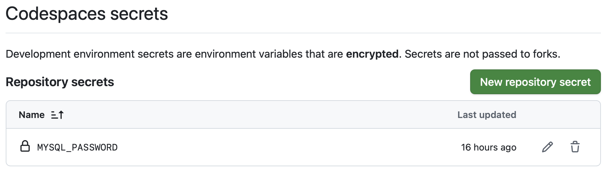
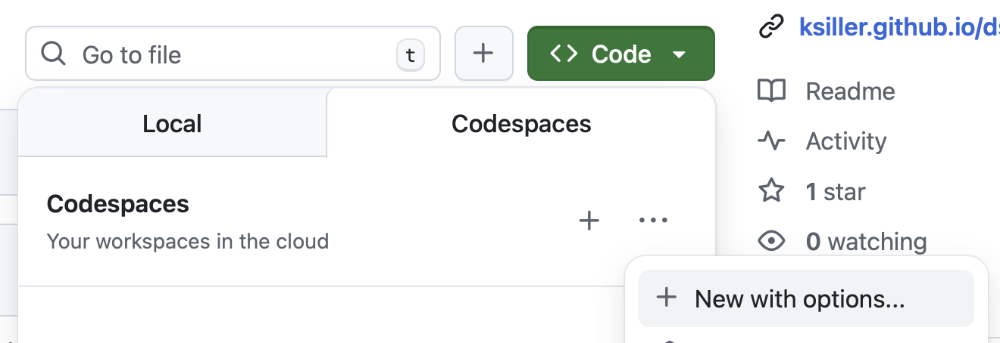
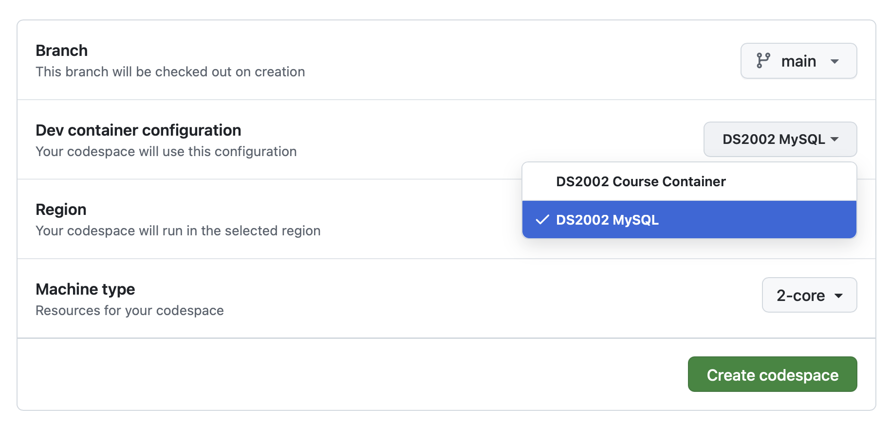

# MySQL Setup in GitHub Codespace

This guide walks you through setting up MySQL in a GitHub Codespace environment, including configuring prebuilds to speed up future Codespace startups.

## Step 1: Add a Secret Password to your GitHub settings

The MySQL container requires a root password to be set via the `MYSQL_PASSWORD` environment variable. You need to add this as a secret in your GitHub repository settings so Codespace can access it.

1. Go to your forked repository on GitHub (e.g., `https://github.com/YOUR_GITHUB_USERNAME/ds2002-course`).

2. Click on **Settings** (in the repository navigation bar, not your general GitHub settings).

3. In the left sidebar, under **Secrets and variables**, click **Codespaces**.

4. Click **New repository secret**.

5. Configure the secret:
   - **Name**: `MYSQL_PASSWORD`
   - **Secret**: Enter a strong password for your MySQL root user (e.g., a random string of letters, numbers, and symbols), but choose something you can remember.
   - Click **Add secret**.

   > **Note:** Choose a secure password and keep it safe. You'll need this password to connect to MySQL in your Codespace. The password is encrypted and only accessible to your Codespaces.

6. Verify the secret appears in your list of Codespace secrets.
   


## Step 2: Start MySQL environment in Codespace

1. On GitHub, go to your forked repository and expand the dropdown of the **Code** button.
   - Your personal copy (fork) should be <a href="https://github.com/YOUR_GITHUB_USERNAME/ds2002-course" target="_blank" rel="noopener noreferrer">https://github.com/YOUR_GITHUB_USERNAME/ds2002-course</a>.

2. Select the **Codespaces** tab.

3. Next to `"Codespaces: your workspaces in the cloud"`, click on the three dots `"..."` and select `"+ New with options"`.
   

4. On the next screen, choose `"DS2002 MySQL"`:
   

5. Click `Create codespace`.

6. Wait for the codespace to initialize (this may take several minutes).

7. Once your codespace is running, open the terminal. The terminal will appear at the bottom of your Codespace window.
   - In the terminal, execute:
     ```bash
     mysql -h dbhost -u root -p
     ```
   - You'll be prompted for your password: enter your MySQL password that you set up in Step 1.
   - The prompt should change to:
      ```bash
      mysql> 
      ```
      **Congratulations! You're logged into the MySQL server.**
   - Type `exit` and press `Enter` to return to the bash terminal.
